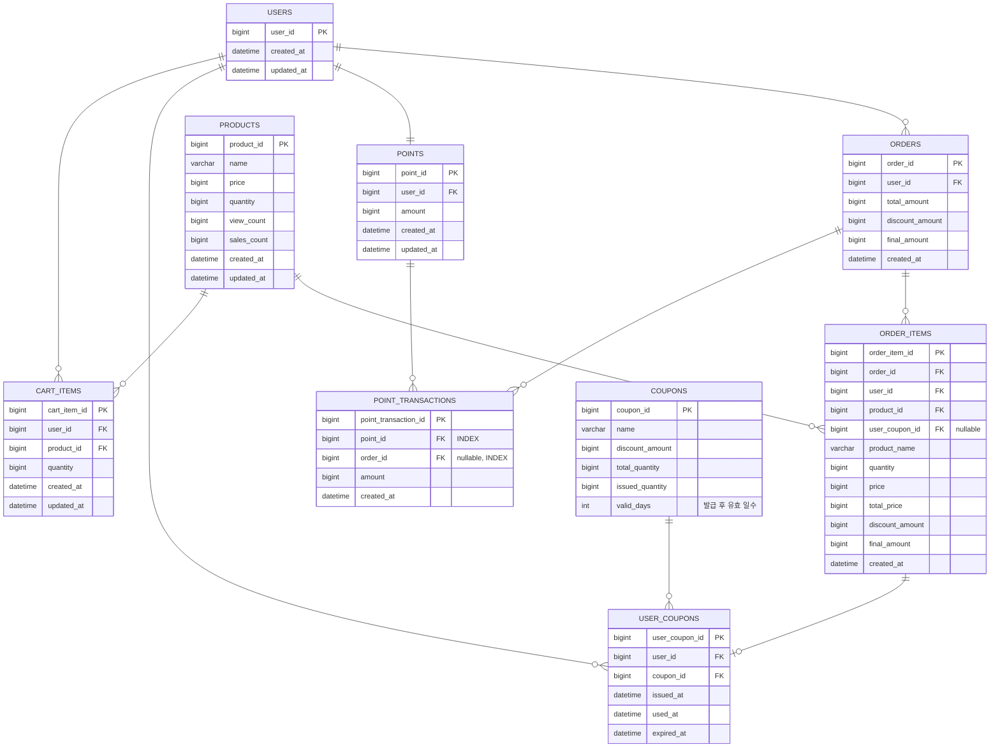
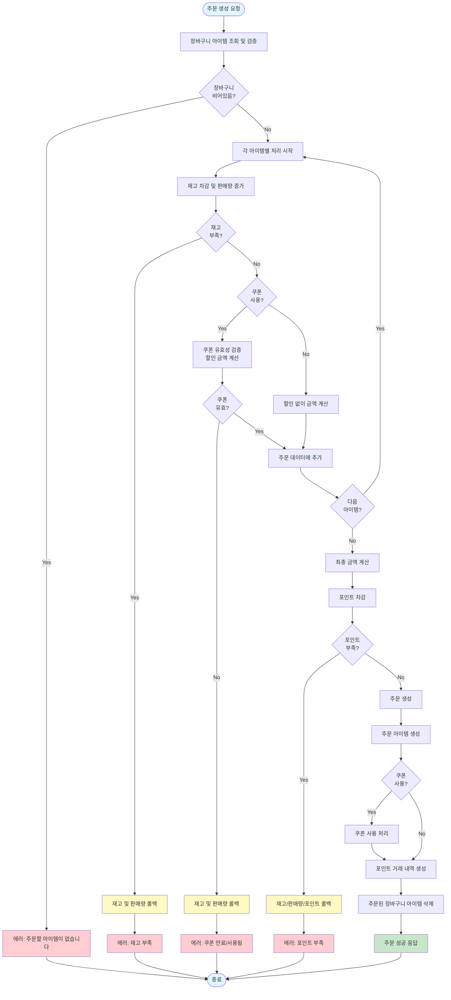
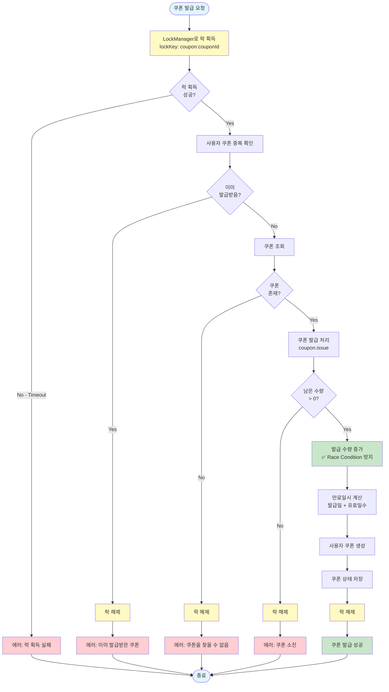
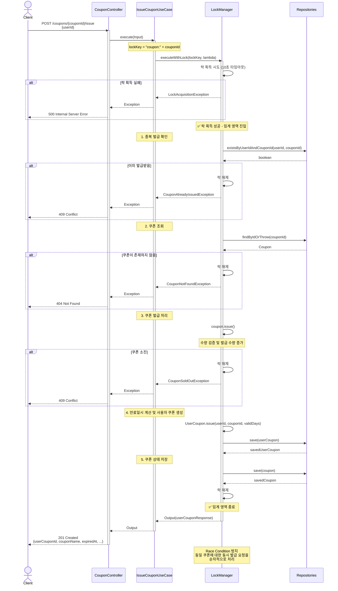
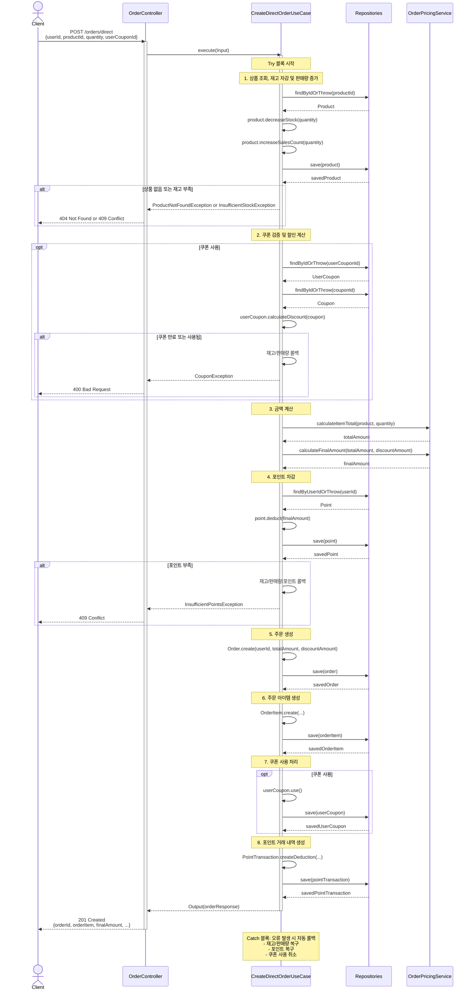
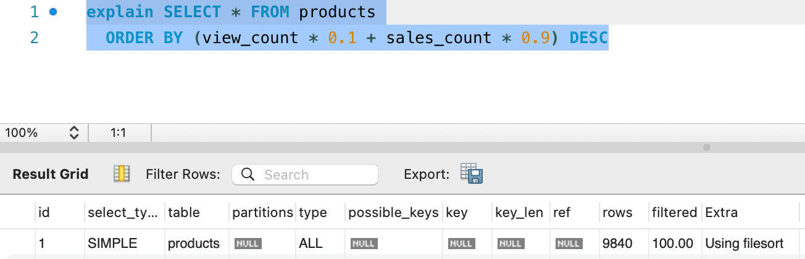
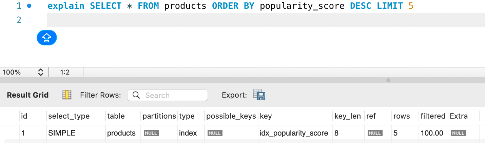

## E-commerce

## 목차

1. [ERD](#erd)
2. [플로우차트](#플로우차트)
3. [시퀀스 다이어그램](#시퀀스-다이어그램)
4. [동시성 제어 방식 비교](#동시성-제어-방식-비교)
5. [아키텍처 설계 결정사항](#아키텍처-설계-결정사항)

---

## ERD



## 플로우차트

### 1. 주문 생성 및 결제 플로우 (CreateOrderUseCase)



### 2. 쿠폰 발급 플로우 (IssueCouponUseCase - LockManager 사용)



### 3. 장바구니 상품 추가 플로우


---

## 시퀀스 다이어그램

### 1. 주문 생성 및 결제 시퀀스 (CreateOrderUseCase)

```mermaid
sequenceDiagram
    actor Client
    participant Controller as OrderController
    participant UseCase as CreateOrderUseCase
    participant Repository as Repositories
    participant PricingService as OrderPricingService

    Client->>Controller: POST /orders<br/>{userId, cartItemCouponMaps}
    activate Controller

    Controller->>UseCase: execute(Input)
    activate UseCase

    Note over UseCase: 1. 장바구니 아이템 조회 및 검증
    loop 각 cartItemId
        UseCase->>Repository: findByIdOrThrow(cartItemId)
        Repository-->>UseCase: CartItem
        UseCase->>UseCase: validateOwnership(userId)
    end

    alt 장바구니가 비어있음
        UseCase-->>Controller: EmptyCartException
        Controller-->>Client: 400 Bad Request
    end

    Note over UseCase: 2. 재고 차감 및 판매량 증가 (Try 블록)
    loop 각 장바구니 아이템
        UseCase->>Repository: findByIdOrThrow(productId)
        Repository-->>UseCase: Product

        UseCase->>UseCase: product.decreaseStock(quantity)
        UseCase->>UseCase: product.increaseSalesCount(quantity)
        UseCase->>Repository: save(product)
        Repository-->>UseCase: savedProduct

        alt 재고 부족
            UseCase->>UseCase: 재고/판매량 롤백
            UseCase-->>Controller: InsufficientStockException
            Controller-->>Client: 409 Conflict
        end

        Note over UseCase: 3. 쿠폰 검증 및 할인 계산
        opt 쿠폰 사용
            UseCase->>Repository: findByIdOrThrow(userCouponId)
            Repository-->>UseCase: UserCoupon
            UseCase->>Repository: findByIdOrThrow(couponId)
            Repository-->>UseCase: Coupon
            UseCase->>UseCase: userCoupon.calculateDiscount(coupon)

            alt 쿠폰 만료 또는 사용됨
                UseCase->>UseCase: 재고/판매량 롤백
                UseCase-->>Controller: CouponException
                Controller-->>Client: 400 Bad Request
            end
        end

        UseCase->>UseCase: orderItemDataList에 추가
    end

    Note over UseCase: 4. 최종 금액 계산
    UseCase->>PricingService: calculateItemTotal(product, quantity)
    PricingService-->>UseCase: itemTotal
    UseCase->>PricingService: calculateFinalAmount(total, discount)
    PricingService-->>UseCase: finalAmount

    Note over UseCase: 5. 포인트 차감
    UseCase->>Repository: findByUserIdOrThrow(userId)
    Repository-->>UseCase: Point
    UseCase->>UseCase: point.deduct(finalAmount)
    UseCase->>Repository: save(point)
    Repository-->>UseCase: savedPoint

    alt 포인트 부족
        UseCase->>UseCase: 재고/판매량/포인트 롤백
        UseCase-->>Controller: InsufficientPointsException
        Controller-->>Client: 409 Conflict
    end

    Note over UseCase: 6. 주문 생성
    UseCase->>UseCase: Order.create(userId, totalAmount, discountAmount)
    UseCase->>Repository: save(order)
    Repository-->>UseCase: savedOrder

    Note over UseCase: 7. 주문 아이템 생성 및 쿠폰 사용 처리
    loop 각 orderItemData
        UseCase->>UseCase: OrderItem.create(...)
        UseCase->>Repository: save(orderItem)
        Repository-->>UseCase: savedOrderItem

        opt 쿠폰 사용
            UseCase->>UseCase: userCoupon.use()
            UseCase->>Repository: save(userCoupon)
            Repository-->>UseCase: savedUserCoupon
        end
    end

    Note over UseCase: 8. 포인트 거래 내역 생성
    UseCase->>UseCase: PointTransaction.createDeduction(...)
    UseCase->>Repository: save(pointTransaction)
    Repository-->>UseCase: savedPointTransaction

    Note over UseCase: 9. 주문된 장바구니 아이템 삭제
    loop 각 cartItem
        UseCase->>Repository: deleteById(cartItemId)
    end

    UseCase-->>Controller: Output(orderResponse)
    deactivate UseCase

    Controller-->>Client: 201 Created<br/>{orderId, orderItems, finalAmount, ...}
    deactivate Controller

    Note over UseCase: Catch 블록: 오류 발생 시 자동 롤백<br/>- 재고/판매량 복구<br/>- 포인트 복구<br/>- 쿠폰 사용 취소
```



### 2. 쿠폰 발급 시퀀스 (IssueCouponUseCase - LockManager 사용)



### 3. 즉시 구매 시퀀스 (CreateDirectOrderUseCase - 장바구니 없이)



---

### 동시성 제어 방식 비교

#### 1. synchronized

- 구현: `synchronized` 키워드 사용
- 적용 범위: 코드 블록, 메서드 단위
- 장점:
  - 자바에서 기본으로 제공하는 기능
  - 락 해제/예외 처리 자동 보장
  - 코드 가독성 높음
- 단점:
  - 블록 범위가 넓어지면 성능 저하 (모니터 락 경쟁)
  - 타임아웃 등 세밀한 제어 불가
  - 분산 환경에서는 동기화 불가

#### 1.1. 임계 영역

- 한 번에 하나의 쓰레드만 접근을 허용해야 하는 코드 영역
```java
class Counter {
    private int count = 0;

    public void increment() {
        // 임계 영역 시작
        count++;
        // 임계 영역 끝
    }
}
```

#### 1.2. 모니터

  - 임계 영역을 관리하는 객체
  - 모든 자바 객체는 모니터를 가지고 있음.
  - 모니터는 내부적으로 하나의 락(lock) 메커니즘을 가지고 있음.
```java
synchronized void increment() {
    count++; // 이 메서드는 모니터(객체)에 의해 보호됨
}
```

#### 1.3. 모니터 락

  - 모니터 내부의 락
  - 스레드가 임계영역에 진입하기 위해 필요한 락 객체
  - 자바에서 어떤 객체든 `synchronized` 키워드를 이용해 모니터 락을 획득할 수 있음.
```java
synchronized (this) { // this 객체의 모니터 락 획득
    count++;
} // 블록이 끝나면 락 자동 해제
```


#### 2. ReentrantLock

- 구현: `ReentrantLock` + `ConcurrentHashMap`
- 적용 범위: 단일 JVM
- 장점:
  - 구현이 간단함
  - DB에 부하가 없음
  - synchronized에 비해 빠른 성능
  - 타임아웃, 공정성 설정 가능
- 단점:
  - 분산 환경에서 지원하지 않음.
  - 반드시 수동으로 unlock() 호출 필요(메모리 누수 위험).
  - 서버 재시작 시 락 상태 초기화됨

#### 2.1. 공정성

- 스레드가 락을 획득하는 순서에 대한 설정

```java
ReentrantLock nonFairLock = new ReentrantLock(); // 기본값: 비공정 락
ReentrantLock fairLock = new ReentrantLock(true); // 공정락
```

#### 2.1.1. 공정락

- 대기 큐(FIFO)에 들어온 순서대로 락을 획득함
- 대기 순서 보장 덕분에 기아 현상이 거의 없음.
- 비공정 락보다 성능이 떨어짐

#### 2.1.2. 비공정락

- 락 획득 시점에 대기 큐를 무시함
- 락이 해제되는 순간 대기 중인 스레드보다 나중에 온 스레드가 먼저 락을 획득할 수도 있음.
- 대기 순서가 보장되지 않아 기아 현상이 생길 수 있음.
- 공정 락보다 성능이 좋음

#### 3. ReentrantReadWriteLock

- 구현: `ReentrantReadWriteLock`
- 적용 범위: 단일 JVM
- 장점:
  - 읽기/쓰기 작업을 분리하여 여러 스레드가 동시에 읽기 가능
  - DB에 부하가 없음
  - synchronized에 비해 빠른 성능
  - 타임아웃, 공정성 설정 가능
  - 읽기가 많은 환경에서는 성능이 좋음
- 단점:
  - 락 관리가 까다로움
  - 읽기 스레드가 많을 경우 쓰기 스레드가 기아 상태에 빠질 수 있음.
  - 분산 환경에서 지원하지 않음.
  - 반드시 수동으로 unlock() 호출 필요(메모리 누수 위험).
  - 서버 재시작 시 락 상태 초기화됨

#### 3.1. 읽기락

- 여러 스레드가 동시에 읽기 가능

```java
ReentrantReadWriteLock lock = new ReentrantReadWriteLock();
private int value = 0;

public int read() {
  lock.readLock().lock();
  try {
    return value;
  } finally {
    lock.readLock().unlock();
  }
}
```

#### 3.2. 쓰기락

- 단 하나의 스레드만 쓰기 가능
```java
ReentrantReadWriteLock lock = new ReentrantReadWriteLock();
private int value = 0;

public void write(int newValue) {
  lock.writeLock().lock();
  try {
    value = newValue;
  } finally {
    lock.writeLock().unlock();
  }
}
```

#### 3.3. 읽기락과 쓰기락 관계

- 읽기 중에는 쓰기 금지, 쓰기 중에는 읽기 금지
- 읽기 락 → 쓰기 락 업그레이드 불가
- 쓰기 락 → 읽기 락 다운그레이드는 가능

#### 4. 분산 락

- 구현: Redis, ZooKeeper, etcd 등 외부 시스템
- 적용 범위: 분산 환경
- 장점:
  - 여러 JVM 간 동기화 가능
  - 분산 환경에서 데이터 정합성 유지
  - 
- 단점:
  - 외부 시스템 의존 (Redis 등)
  - 네트워크 지연 시 성능 저하

---

### 선택 기준 및 트레이드오프

#### 현재 선택: ReentrantLock

**선택 이유:**

- 현재 `ConcurrentHashMap`을 이용한 인메모리 리포지토리 사용
- DB가 없어 DB 락 불가능
- 단일 애플리케이션
- 메모리 내 락으로 성능이 우수함

**트레이드오프:**

- 이득
  - 빠른 개발 속도
  - 단순한 구조
  - 높은 성능
- 손실
  - 단일 JVM 제약
  - 확장성 제한
  - 메모리 누수 위험

---

## 아키텍처 설계 결정사항

#### 설계 결정 이유

1. UseCase 

- 장점:
  - 각 유스케이스의 명확한 트랜잭션 경계
  - 비즈니스 요구사항과 1:1 매핑
  - 테스트 격리 용이
  - 새로운 기능 추가 시 기존 코드 영향 없음

- 단점:
  - 클래스 수 증가 (현재 20+ UseCase)
  - 공통 로직 중복 가능성(장바구니 주문과 상품 직접 주문) → Domain Service로 해결

2. Rich Domain Model

- 장점:
  - 비즈니스 규칙 캡슐화
  - 재사용성
  - 테스트 용이

3. Factory Method 패턴

- 이유:
  - ID 할당 책임을 Repository가 담당함

4. 수동 롤백 방식 (Try-Catch)

- 현재 (인메모리 저장소):
  - `@Transactional` 사용 불가

5. 도메인 모듈별 ErrorCode enum 적용 및 BaseException 상속

- 장점:
  - HTTP 상태 코드가 도메인 예외에 명시됨
  - 에러 코드 중앙 관리

- 단점:
  - 런타임 예외 위험

6. ApiResponse 래퍼 패턴

- 장점:
  - 일관된 응답 구조
  - 에러 처리 일관성 (모든 API 동일 구조)
  - 문서화 용이

- 대안
  - HATEOAS

## 인기 상품 조회 쿼리 성능 분석

### 1. 개요

인기 상품 조회 쿼리 내에 정렬 시 성능 저하가 발생할 것으로 예상합니다.

### 2. 문제 쿼리

```sql
SELECT * 
FROM products
ORDER BY (view_count * 0.1 + sales_count * 0.9) DESC
LIMIT 5;
```

### 3. 실행 계획 (인덱스 없음)

#### EXPLAIN 결과



| id | type | table    | possible_keys | key  | rows | Extra          |
| -- | ---- |----------| ------------- | ---- |------| -------------- |
| 1  | ALL  | products | NULL          | NULL | 9840 | Using filesort |

#### EXPLAIN ANALYZE 결과


```
-> Sort: ((products.view_count * 0.1) + (products.sales_count * 0.9)) DESC (cost=1024 rows=9840) (actual time=24.6..26.1 rows=10000 loops=1)
    -> Table scan on products  (cost=1024 rows=9840) (actual time=0.862..10.5 rows=10000 loops=1)
```

#### 분석 요약

- Full Table Scan 발생: 모든 행(약 10,000개)을 읽음
- Filesort 사용: 메모리 또는 디스크 정렬 수행
- 정렬식 계산으로 인해 인덱스 활용 불가
- 평균 실행 시간
  - 10,000건: 약 50ms
  -100,000건: 약 500ms

#### 병목 원인

- 계산식 기반 정렬로 인해 인덱스 사용 불가
- 모든 행을 읽고 계산 및 정렬하는 비효율적 수행

### 4. 개선 방안
4.1 popularity_score 컬럼 추가 및 인덱스 생성

조회 시 매번 (view_count * 0.1 + sales_count * 0.9)를 계산하지 않도록
별도의 컬럼을 추가하고 인덱싱합니다.

```
ALTER TABLE products 
ADD COLUMN popularity_score DECIMAL(10,2) 
GENERATED ALWAYS AS (view_count * 0.1 + sales_count * 0.9) STORED;

CREATE INDEX idx_popularity_score ON products (popularity_score DESC);
```

### 5. 실행 계획 (인덱스 추가 후)

#### EXPLAIN 결과



| id   | type | table    | possible_keys | key | rows | Extra |
|------|------|----------|---------------|-----|------|-------|
| 1    |      | products |               |     |      |       |

#### EXPLAIN ANALYZE 결과


```
'-> Limit: 5 row(s)  (cost=0.0207 rows=5) (actual time=0.239..0.241 rows=5 loops=1)
    -> Index scan on p using idx_popularity_score  (cost=0.0207 rows=5) (actual time=0.234..0.235 rows=5 loops=1)

```

### 6. 성능 비교

#### 6.1 실행 계획 비교

| 항목        | 인덱스 없음 (Before)       | 인덱스 있음 (After)       | 개선 효과          |
|-----------|-----------------------|----------------------|----------------|
| **type**  | ALL (Full Table Scan) | index (Index Scan)   | ✅ Full Scan 제거 |
| **key**   | NULL                  | idx_popularity_score | ✅ 인덱스 사용       |
| **rows**  | 9,840                 | 5                    | ✅ 99.95% 감소    |
| **Extra** | Using filesort        | -                    | ✅ 정렬 작업 제거     |

#### 6.2 실제 실행 시간 비교

| 데이터 건수    | Before (Filesort) | After (Index Scan) | 성능 개선 비율     |
|-----------|-------------------|--------------------|--------------|
| 10,000건   | ~50ms             | ~0.24ms            | **약 208배**   |
| 100,000건  | ~500ms            | ~0.24ms            | **약 2,083배** |

#### 6.3 핵심 개선 사항

1. **Full Table Scan → Index Scan**
   - Before: 10,000개 행 전체를 읽고 정렬
   - After: 인덱스에서 상위 5개만 직접 조회

2. **Filesort 제거**
   - Before: 메모리/디스크에서 정렬 작업 수행
   - After: 인덱스가 이미 DESC 순서로 정렬되어 있어 정렬 불필요

3. **계산식 제거**
   - Before: 각 행마다 `(view_count * 0.1 + sales_count * 0.9)` 계산
   - After: 사전 계산된 `popularity_score` 컬럼 사용

### 7. 결론

#### 7.1 최적화 효과

인기 상품 조회 쿼리에 `popularity_score` 컬럼 추가 및 인덱스 생성을 통해:

- **성능 개선: 208~2,083배**
- **실행 시간: 50ms → 0.24ms (10,000건 기준)**
- **Full Table Scan 완전 제거**

#### 7.2 핵심 학습 포인트

1. **계산식 기반 정렬은 인덱스를 사용할 수 없음**
   - `ORDER BY (view_count * 0.1 + sales_count * 0.9)`는 항상 Filesort 발생
   - 해결책: 계산 결과를 컬럼으로 저장 (Computed Column 패턴)

2. **LIMIT 쿼리에서 인덱스의 중요성**
   - 상위 N개만 필요한 경우, 인덱스가 있으면 N개만 읽고 종료
   - 인덱스가 없으면 전체 데이터를 읽고 정렬 후 N개 선택

3. **DESC 인덱스 최적화**
   - `ORDER BY ... DESC` 쿼리는 DESC 인덱스로 Backward Index Scan 수행
   - MySQL 8.0+에서는 인덱스 생성 시 DESC 키워드 지원

#### 7.4 트레이드오프

**이득:**
- 조회 성능 208~2,083배 개선
- Filesort로 인한 메모리/디스크 I/O 부담 제거

**비용:**
- 추가 컬럼으로 인한 디스크 사용량 증가 (컬럼당 8 bytes)
- `view_count`, `sales_count` 업데이트 시 `popularity_score`도 함께 업데이트 필요
- 인덱스 유지 비용 (INSERT/UPDATE 시 인덱스 재정렬)

**결론:** 조회 빈도가 높고 데이터가 많은 시스템에서는 이득이 비용을 압도적으로 상회합니다.

