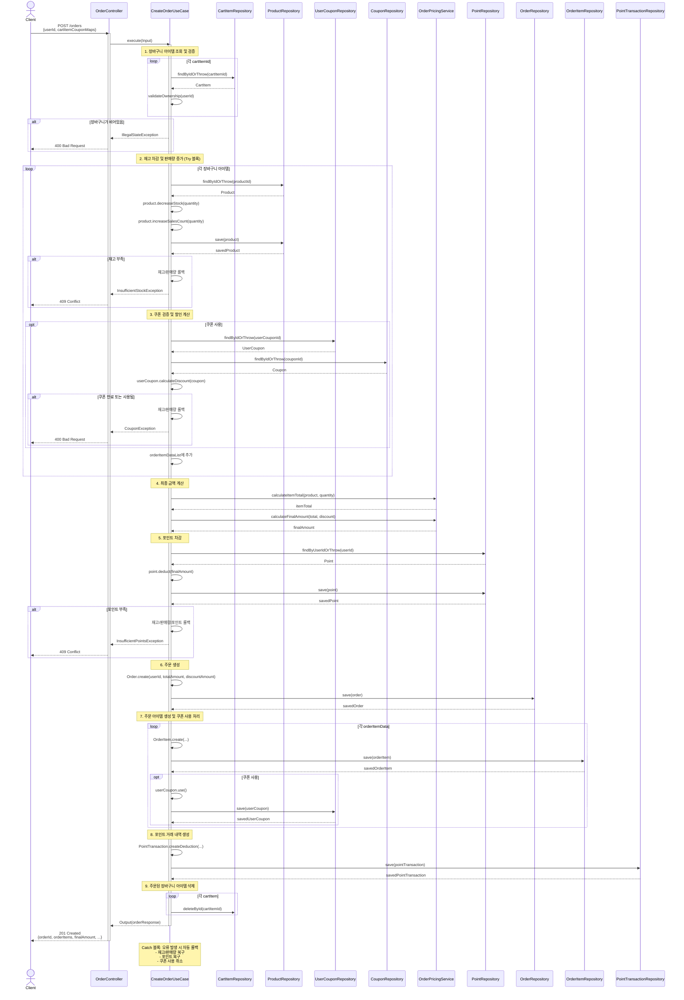
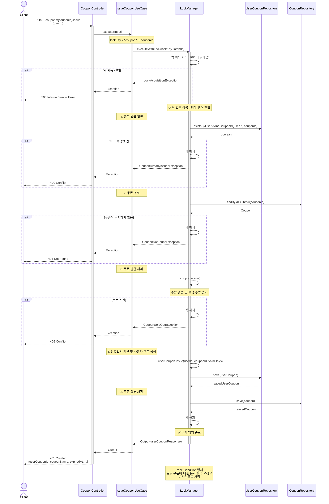
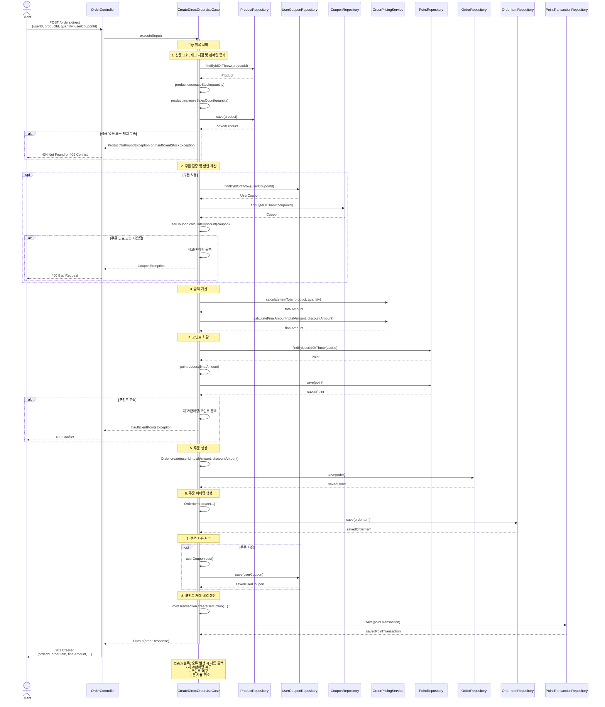

## E-commerce

### ERD

## 플로우차트

### 1. 주문 생성 및 결제 플로우 (CreateOrderUseCase)

### 2. 쿠폰 발급 플로우 (IssueCouponUseCase - LockManager 사용)

### 3. 장바구니 상품 추가 플로우

---

## 시퀀스 다이어그램

### 1. 주문 생성 및 결제 시퀀스 (CreateOrderUseCase)

### 2. 쿠폰 발급 시퀀스 (IssueCouponUseCase - LockManager 사용)

### 3. 즉시 구매 시퀀스 (CreateDirectOrderUseCase - 장바구니 없이)

