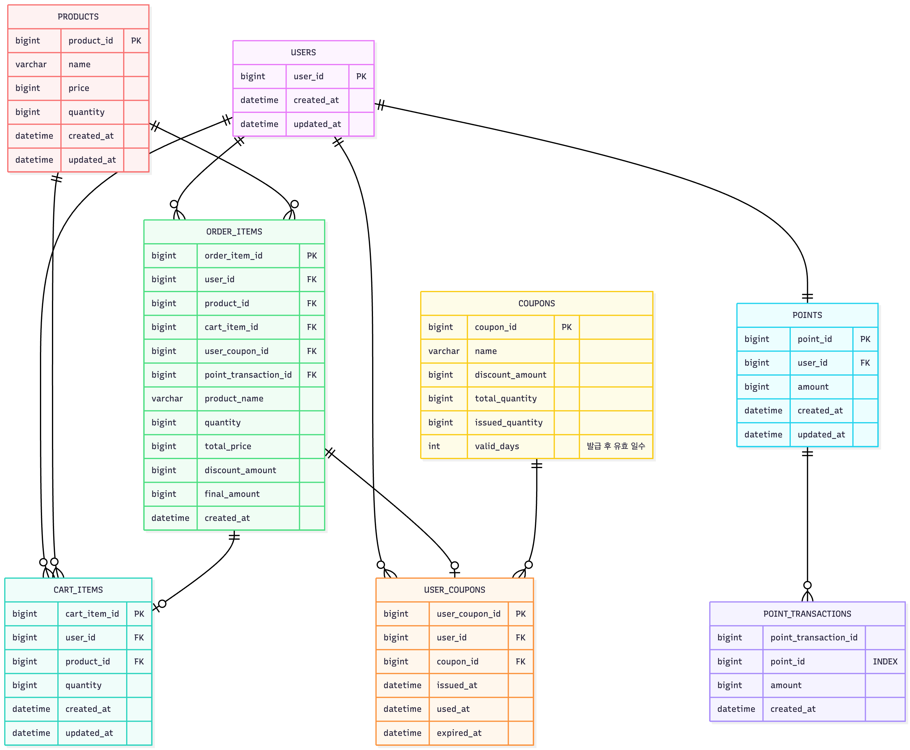
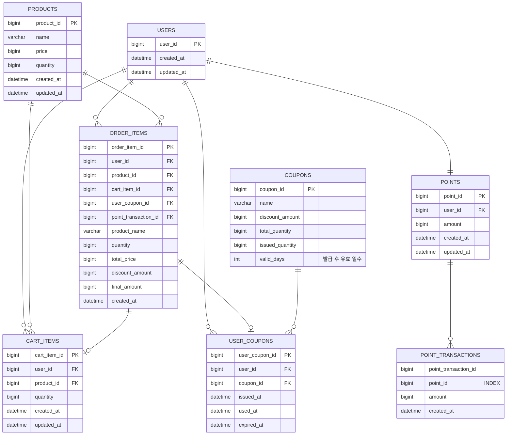

## E-commerce ERD

```mermaid
erDiagram
    USERS ||--o{ CART_ITEMS : ""
    USERS ||--o{ USER_COUPONS : ""
    USERS ||--|| POINTS : ""
    USERS ||--o{ ORDER_ITEMS : ""
    USERS {
        bigint user_id PK
        datetime created_at
        datetime updated_at
    }

    POINTS {
        bigint point_id PK
        bigint user_id FK
        bigint amount
        datetime created_at
        datetime updated_at
    }

    POINTS ||--o{ POINT_TRANSACTIONS : ""
    POINT_TRANSACTIONS {
        bigint point_transaction_id
        bigint point_id "INDEX"
        bigint amount
        datetime created_at
    }

    PRODUCTS ||--o{ CART_ITEMS : ""
    PRODUCTS ||--o{ ORDER_ITEMS : ""
    PRODUCTS {
        bigint product_id PK
        varchar name
        bigint price
        bigint quantity
        datetime created_at
        datetime updated_at
    }

    ORDER_ITEMS ||--o| CART_ITEMS : ""
    ORDER_ITEMS ||--o| USER_COUPONS : ""
    ORDER_ITEMS {
        bigint order_item_id PK
        bigint user_id FK
        bigint product_id FK
        bigint cart_item_id FK
        bigint user_coupon_id FK
        bigint point_transaction_id FK
        varchar product_name
        bigint quantity
        bigint total_price
        bigint discount_amount
        bigint final_amount
        datetime created_at
    }

    CART_ITEMS {
        bigint cart_item_id PK
        bigint user_id FK
        bigint product_id FK
        bigint quantity
        datetime created_at
        datetime updated_at
    }

    COUPONS ||--o{ USER_COUPONS : ""
    COUPONS {
        bigint coupon_id PK
        varchar name
        bigint discount_amount
        bigint total_quantity
        bigint issued_quantity
        int valid_days "발급 후 유효 일수"
    }

    USER_COUPONS {
        bigint user_coupon_id PK
        bigint user_id FK
        bigint coupon_id FK
        datetime issued_at
        datetime used_at
        datetime expired_at
    }
```
