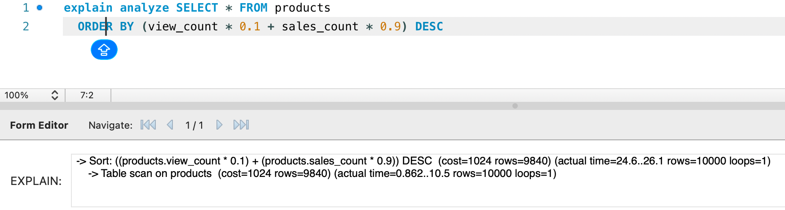
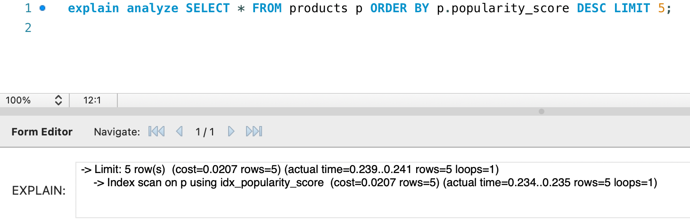

## 인기 상품 조회 쿼리 성능 분석

### 1. 개요

인기 상품 조회 쿼리 내에 정렬 시 성능 저하가 발생할 것으로 예상합니다.

### 2. 문제 쿼리

```sql
SELECT * 
FROM products
ORDER BY (view_count * 0.1 + sales_count * 0.9) DESC
LIMIT 5;
```

### 3. 실행 계획 (인덱스 없음)

#### EXPLAIN 결과


| id | type | table    | possible_keys | key  | rows | Extra          |
| -- | ---- |----------| ------------- | ---- |------| -------------- |
| 1  | ALL  | products | NULL          | NULL | 9840 | Using filesort |

#### EXPLAIN ANALYZE 결과



```
-> Sort: ((products.view_count * 0.1) + (products.sales_count * 0.9)) DESC (cost=1024 rows=9840) (actual time=24.6..26.1 rows=10000 loops=1)
    -> Table scan on products  (cost=1024 rows=9840) (actual time=0.862..10.5 rows=10000 loops=1)
```

#### 분석 요약

- Full Table Scan 발생: 모든 행(약 10,000개)을 읽음
- Filesort 사용: 메모리 또는 디스크 정렬 수행
- 정렬식 계산으로 인해 인덱스 활용 불가
- 평균 실행 시간
    - 10,000건: 약 50ms
      -100,000건: 약 500ms

#### 병목 원인

- 계산식 기반 정렬로 인해 인덱스 사용 불가
- 모든 행을 읽고 계산 및 정렬하는 비효율적 수행

### 4. 개선 방안
4.1 popularity_score 컬럼 추가 및 인덱스 생성

조회 시 매번 (view_count * 0.1 + sales_count * 0.9)를 계산하지 않도록
별도의 컬럼을 추가하고 인덱싱합니다.

```
ALTER TABLE products 
ADD COLUMN popularity_score DECIMAL(10,2) 
GENERATED ALWAYS AS (view_count * 0.1 + sales_count * 0.9) STORED;

CREATE INDEX idx_popularity_score ON products (popularity_score DESC);
```

### 5. 실행 계획 (인덱스 추가 후)

#### EXPLAIN 결과


| id   | type | table    | possible_keys | key | rows | Extra |
|------|------|----------|---------------|-----|------|-------|
| 1    |      | products |               |     |      |       |

#### EXPLAIN ANALYZE 결과



```
'-> Limit: 5 row(s)  (cost=0.0207 rows=5) (actual time=0.239..0.241 rows=5 loops=1)
    -> Index scan on p using idx_popularity_score  (cost=0.0207 rows=5) (actual time=0.234..0.235 rows=5 loops=1)

```

### 6. 성능 비교

#### 6.1 실행 계획 비교

| 항목        | 인덱스 없음 (Before)       | 인덱스 있음 (After)       | 개선 효과          |
|-----------|-----------------------|----------------------|----------------|
| **type**  | ALL (Full Table Scan) | index (Index Scan)   | ✅ Full Scan 제거 |
| **key**   | NULL                  | idx_popularity_score | ✅ 인덱스 사용       |
| **rows**  | 9,840                 | 5                    | ✅ 99.95% 감소    |
| **Extra** | Using filesort        | -                    | ✅ 정렬 작업 제거     |

#### 6.2 실제 실행 시간 비교

| 데이터 건수    | Before (Filesort) | After (Index Scan) | 성능 개선 비율     |
|-----------|-------------------|--------------------|--------------|
| 10,000건   | ~50ms             | ~0.24ms            | **약 208배**   |
| 100,000건  | ~500ms            | ~0.24ms            | **약 2,083배** |

#### 6.3 핵심 개선 사항

1. **Full Table Scan → Index Scan**
    - Before: 10,000개 행 전체를 읽고 정렬
    - After: 인덱스에서 상위 5개만 직접 조회

2. **Filesort 제거**
    - Before: 메모리/디스크에서 정렬 작업 수행
    - After: 인덱스가 이미 DESC 순서로 정렬되어 있어 정렬 불필요

3. **계산식 제거**
    - Before: 각 행마다 `(view_count * 0.1 + sales_count * 0.9)` 계산
    - After: 사전 계산된 `popularity_score` 컬럼 사용

### 7. 결론

#### 7.1 최적화 효과

인기 상품 조회 쿼리에 `popularity_score` 컬럼 추가 및 인덱스 생성을 통해:

- **성능 개선: 208~2,083배**
- **실행 시간: 50ms → 0.24ms (10,000건 기준)**
- **Full Table Scan 완전 제거**

#### 7.2 핵심 학습 포인트

1. **계산식 기반 정렬은 인덱스를 사용할 수 없음**
    - `ORDER BY (view_count * 0.1 + sales_count * 0.9)`는 항상 Filesort 발생
    - 해결책: 계산 결과를 컬럼으로 저장 (Computed Column 패턴)

2. **LIMIT 쿼리에서 인덱스의 중요성**
    - 상위 N개만 필요한 경우, 인덱스가 있으면 N개만 읽고 종료
    - 인덱스가 없으면 전체 데이터를 읽고 정렬 후 N개 선택

3. **DESC 인덱스 최적화**
    - `ORDER BY ... DESC` 쿼리는 DESC 인덱스로 Backward Index Scan 수행
    - MySQL 8.0+에서는 인덱스 생성 시 DESC 키워드 지원

#### 7.4 트레이드오프

**이득:**
- 조회 성능 208~2,083배 개선
- Filesort로 인한 메모리/디스크 I/O 부담 제거

**비용:**
- 추가 컬럼으로 인한 디스크 사용량 증가 (컬럼당 8 bytes)
- `view_count`, `sales_count` 업데이트 시 `popularity_score`도 함께 업데이트 필요
- 인덱스 유지 비용 (INSERT/UPDATE 시 인덱스 재정렬)

**결론:** 조회 빈도가 높고 데이터가 많은 시스템에서는 이득이 비용을 압도적으로 상회합니다.

