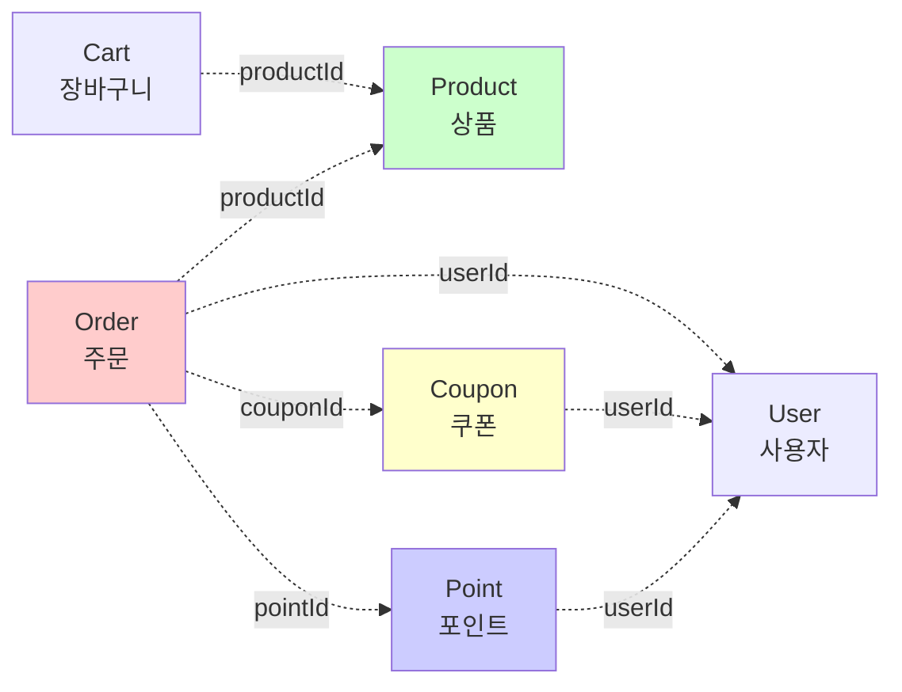
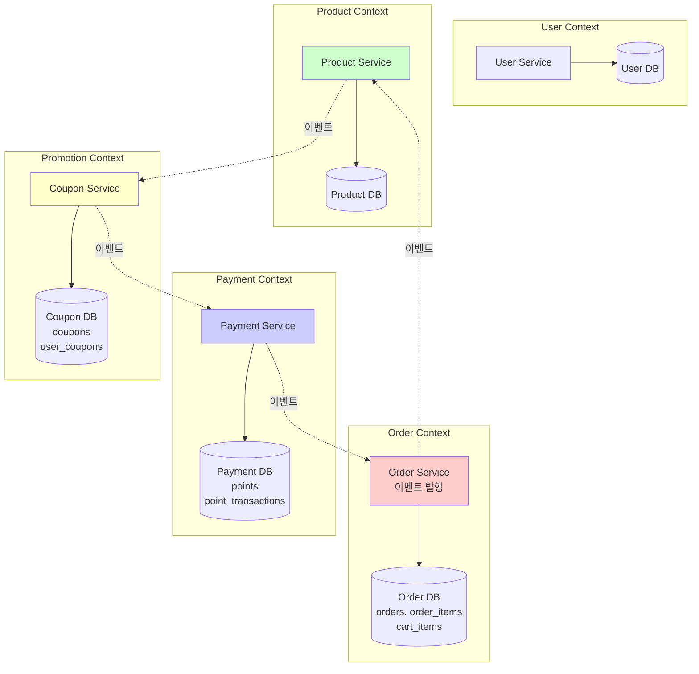
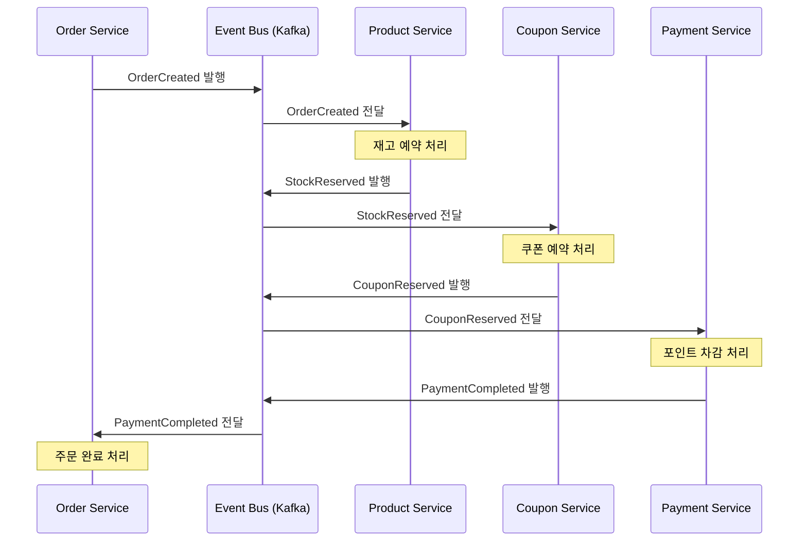
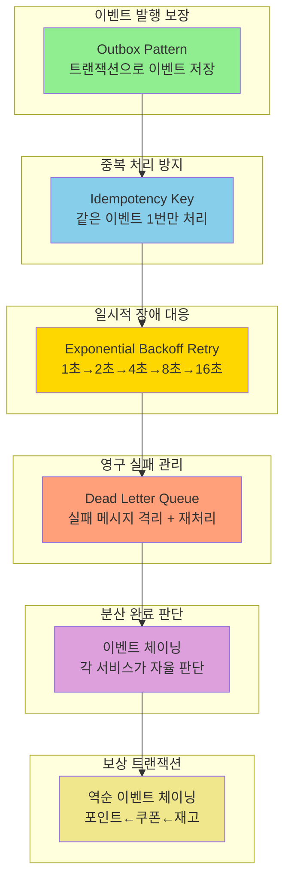

# Choreography Saga 패턴 설계: 대용량 처리를 위한 분산 트랜잭션

## 개요

본 문서는 대용량 트래픽 환경에서 **Choreography Saga 패턴**을 통해 분산 트랜잭션 문제를 해결하는 방법을 설명합니다. Outbox Pattern, DLQ, Retry, Idempotency를 조합하여 **비즈니스 무결성을 보장**하면서도 **높은 처리량과 확장성**을 달성할 수 있습니다.

---

## 1. 서비스 분리 설계

### 1.1 도메인 의존성 분석

현재 시스템의 도메인 간 의존 관계:



**의존도 분석:**

| 도메인 | 주요 엔티티 | 의존 대상 | 의존도 | 특징 |
|--------|------------|----------|--------|------|
| **User** | User | - | 독립 | 다른 도메인에 의존하지 않음 |
| **Product** | Product | - | 독립 | 재고 관리가 핵심 |
| **Point** | Point, PointTransaction | User (userId) | 낮음 | 금융 도메인, 독립 분리 가능 |
| **Coupon** | Coupon, UserCoupon | User (userId) | 낮음 | 프로모션 도메인, 독립 분리 가능 |
| **Cart** | CartItem | User, Product | 중간 | Order 도메인에 포함 가능 |
| **Order** | Order, OrderItem | User, Product, Coupon, Point, Cart | **높음** | **모든 도메인과 상호작용** |

**핵심 발견:**
- ⚠️ **Order 도메인이 모든 도메인에 의존** → 분산 트랜잭션의 핵심 문제
- ✅ User, Product, Point, Coupon은 상대적으로 독립적 → 분리 용이

---

### 1.2 서비스 경계 정의 (DDD Bounded Context)



---

### 1.3 서비스별 책임

#### User Service
- **책임:** 사용자 정보 관리
- **데이터:** `users` 테이블
- **특징:** 독립적, 읽기 전용 API 중심

#### Product Service
- **책임:** 상품 관리 + **재고 관리**
- **데이터:** `products`, `product_reservations` 테이블
- **특징:** 재고 관리가 핵심 (2-Phase Reservation)
- **핵심 이벤트:**
    - 구독: `order.created` → 재고 예약
    - 발행: `stock.reserved` → 다음 단계 트리거
    - 보상: `stock.compensation.required` → 재고 복원

#### Payment Service
- **책임:** 포인트 충전/차감, 결제 트랜잭션 관리
- **데이터:** `points`, `point_transactions` 테이블
- **특징:** 금융 도메인, 멱등성 필수
- **핵심 이벤트:**
    - 구독: `coupon.reserved` → 포인트 차감
    - 발행: `payment.completed` → 주문 완료 트리거
    - 보상: `payment.failed` → 보상 체인 시작

#### Coupon Service
- **책임:** 쿠폰 발급 및 사용 관리
- **데이터:** `coupons`, `user_coupons` 테이블
- **특징:** 프로모션 도메인, 분산 락 필요
- **핵심 이벤트:**
    - 구독: `stock.reserved` → 쿠폰 예약
    - 발행: `coupon.reserved` → 다음 단계 트리거
    - 보상: `coupon.compensation.required` → 쿠폰 복원

#### Order Service
- **책임:** 주문 생성 및 관리
- **데이터:** `orders`, `order_items`, `cart_items` 테이블
- **특징:** 이벤트 체이닝의 시작점과 종료점
- **핵심 이벤트:**
    - 발행: `order.created` → Saga 시작
    - 구독: `payment.completed` → 주문 완료 처리
    - 구독: `order.failed` → 주문 실패 처리

---

## 2. Choreography 패턴의 핵심 아이디어

### 2.1 중앙 관리자 없는 분산 조율

Choreography 패턴에서는 중앙의 Orchestrator 없이, 각 서비스가 **이벤트를 발행하고 구독**하면서 스스로 다음 단계를 진행합니다.



**핵심 특징**:
- 각 서비스는 자신이 처리할 이벤트만 구독
- 중앙 조율자 없이 **이벤트 체이닝**으로 순차 실행
- 서비스 간 **느슨한 결합** (이벤트만 의존)

### 2.2 Pure Choreography의 장점

Pure Choreography는 성능보다는 **서비스 간 느슨한 결합**과 **독립적인 확장성**에 초점을 둡니다.

#### 처리 방식 비교

**Orchestration (동기 호출)**:
```
Order Service가 각 서비스를 직접 호출:

재고 예약: 50ms
    ↓ (동기 대기)
쿠폰 예약: 30ms
    ↓ (동기 대기)
포인트 차감: 40ms
-------------------
총 시간: 120ms
```

**Pure Choreography (이벤트 체이닝)**:
```
각 서비스가 이벤트를 듣고 순차 실행:

재고 예약: 50ms + Kafka (5ms)
    ↓ (이벤트 체이닝)
쿠폰 예약: 30ms + Kafka (5ms)
    ↓ (이벤트 체이닝)
포인트 차감: 40ms + Kafka (5ms)
-------------------
총 시간: 135ms
```

**Choreography의 핵심 가치**:
- **느슨한 결합**: Order Service는 다른 서비스를 직접 호출하지 않음
- **독립 배포**: Product/Coupon/Payment 서비스를 독립적으로 배포 가능
- **장애 격리**: 한 서비스 장애가 다른 서비스로 전파되지 않음 (이벤트 큐에 대기)
- **무정지 배포**: Kafka 큐가 버퍼 역할, 서비스 재시작 중에도 메시지 보존

---

## 3. 비즈니스 무결성 보장 메커니즘

Choreography 패턴이 무결성을 보장하기 위해서는 다음 5가지 메커니즘이 필수입니다.

### 3.1 Outbox Pattern: 이벤트 발행 보장

**문제**: 데이터베이스 커밋은 성공했지만 이벤트 발행 전에 서버가 크래시하면?

```java
@Transactional
public void reserveStock(Long productId, Long quantity) {
  // 1. 재고 차감
  Product product = productRepository.findById(productId).orElseThrow();
  product.decreaseStock(quantity);
  productRepository.save(product);

  // 2. 이벤트 발행 (❌ 여기서 서버 크래시 시 이벤트 유실!)
  kafkaProducer.send("stock.reserved", new StockReservedEvent(product));
}
```

**해결책: Outbox Pattern**

이벤트를 데이터베이스 테이블에 먼저 저장하고, 별도 프로세스가 폴링하여 발행합니다.

```java
@Entity
@Table(name = "outbox_events")
public class OutboxEvent {
  @Id
  private String id;

  @Column(nullable = false)
  private String aggregateType;  // "ORDER", "PRODUCT", "COUPON"

  @Column(nullable = false)
  private String aggregateId;    // 주문 ID, 상품 ID 등

  @Column(nullable = false)
  private String eventType;      // "OrderCreated", "StockReserved"

  @Column(columnDefinition = "TEXT")
  private String payload;        // JSON 직렬화된 이벤트 데이터

  @Column(nullable = false)
  private LocalDateTime createdAt;

  @Column(nullable = false)
  private String status;         // "PENDING", "PUBLISHED", "FAILED"

  @Column
  private Integer retryCount;
}
```

**트랜잭션으로 보장**:

```java
@Transactional
public void reserveStock(Long productId, Long quantity) {
  // 1. 재고 차감
  Product product = productRepository.findById(productId).orElseThrow();
  product.decreaseStock(quantity);
  productRepository.save(product);

  // 2. Outbox에 이벤트 저장 (같은 트랜잭션!)
  OutboxEvent event = OutboxEvent.create(
      "PRODUCT",
      product.getId().toString(),
      "StockReserved",
      serializeToJson(new StockReservedEvent(product))
  );
  outboxRepository.save(event);

  // ✅ 둘 다 성공하거나 둘 다 실패 (원자성 보장)
}
```

**이벤트 발행 담당 스케줄러**:

```java
@Component
@RequiredArgsConstructor
public class OutboxEventPublisher {

  private final OutboxRepository outboxRepository;
  private final KafkaTemplate<String, String> kafkaTemplate;

  @Scheduled(fixedDelay = 1000) // 1초마다
  @DistributedLock(lockKey = "outbox:publisher", waitTime = 0, leaseTime = 5)
  public void publishPendingEvents() {
    List<OutboxEvent> pendingEvents = outboxRepository
        .findByStatusOrderByCreatedAtAsc("PENDING", PageRequest.of(0, 100));

    for (OutboxEvent event : pendingEvents) {
      try {
        // Kafka로 발행
        kafkaTemplate.send(
            getTopicName(event.getEventType()),
            event.getAggregateId(),
            event.getPayload()
        );

        // 발행 성공 표시
        event.markAsPublished();
        outboxRepository.save(event);

        log.info("Outbox 이벤트 발행 성공 - id: {}, type: {}",
            event.getId(), event.getEventType());

      } catch (Exception e) {
        // 재시도 카운트 증가
        event.incrementRetryCount();

        // 5번 실패 시 FAILED 상태로 변경
        if (event.getRetryCount() >= 5) {
          event.markAsFailed();
          log.error("Outbox 이벤트 발행 실패 (최대 재시도 초과) - id: {}",
              event.getId(), e);
        }

        outboxRepository.save(event);
      }
    }
  }

  private String getTopicName(String eventType) {
    return switch (eventType) {
      case "OrderCreated" -> "order.created";
      case "StockReserved" -> "stock.reserved";
      case "CouponReserved" -> "coupon.reserved";
      case "PaymentCompleted" -> "payment.completed";
      default -> throw new IllegalArgumentException("Unknown event type: " + eventType);
    };
  }
}
```

**무결성 보장 원리**:
1. 재고 차감과 이벤트 저장이 **하나의 트랜잭션**
2. 둘 다 성공하거나 둘 다 실패 (원자성)
3. 서버가 크래시되어도 이벤트는 데이터베이스에 남아있음
4. 재시작 후 스케줄러가 미발행 이벤트를 다시 발행

### 3.2 Idempotency: 중복 처리 방지

**문제**: 네트워크 타임아웃으로 같은 이벤트가 여러 번 전달되면?

```
Product Service → Kafka: StockReserved 발행
    ↓ (네트워크 타임아웃)
    ↓ (재시도)
Kafka → Coupon Service: StockReserved 이벤트 전달
    ↓ (또 타임아웃)
    ↓ (재시도)
Coupon Service: 같은 이벤트를 2번 처리! ❌
```

**해결책: Idempotency Key**

각 이벤트마다 고유한 Idempotency Key를 생성하여, 이미 처리한 이벤트는 스킵합니다.

```java
@Entity
@Table(name = "idempotency_records",
    indexes = @Index(name = "idx_idempotency_key", columnList = "idempotency_key", unique = true))
public class IdempotencyRecord {
  @Id
  private String id;

  @Column(unique = true, nullable = false)
  private String idempotencyKey;  // "ORDER:12345:RESERVE_COUPON"

  @Column(nullable = false)
  private String eventType;

  @Column(columnDefinition = "TEXT")
  private String response;        // 처리 결과 (재시도 시 반환)

  @Column(nullable = false)
  private LocalDateTime processedAt;

  @Column(nullable = false)
  private LocalDateTime expiresAt;  // 24시간 후 삭제
}
```

**이벤트 리스너에서 사용**:

```java
@Service
@RequiredArgsConstructor
public class CouponEventListener {

  private final IdempotencyRepository idempotencyRepository;
  private final CouponService couponService;

  @KafkaListener(topics = "stock.reserved")
  @Transactional
  public void handleStockReserved(StockReservedEvent event) {
    // Idempotency Key 생성 (주문ID + 단계명)
    String idempotencyKey = "ORDER:" + event.getOrderId() + ":RESERVE_COUPON";

    // 1. 이미 처리한 이벤트인지 확인
    Optional<IdempotencyRecord> existing = idempotencyRepository
        .findByIdempotencyKey(idempotencyKey);

    if (existing.isPresent()) {
      log.info("이미 처리된 이벤트 (멱등성 보장) - key: {}", idempotencyKey);
      // 기존 응답 반환 (재발행할 이벤트도 동일)
      republishEvent(existing.get().getResponse());
      return;
    }

    // 2. 신규 이벤트 처리
    try {
      CouponReservedEvent result = couponService.reserveCoupon(
          event.getOrderId(),
          event.getCouponId()
      );

      // 3. Idempotency 레코드 저장 (24시간 TTL)
      IdempotencyRecord record = IdempotencyRecord.create(
          idempotencyKey,
          "StockReserved",
          serializeToJson(result),
          LocalDateTime.now().plusHours(24)
      );
      idempotencyRepository.save(record);

      // 4. 다음 단계 이벤트 발행 (Outbox 사용)
      publishEvent(result);

      log.info("쿠폰 예약 성공 - orderId: {}, key: {}",
          event.getOrderId(), idempotencyKey);

    } catch (Exception e) {
      log.error("쿠폰 예약 실패 - orderId: {}", event.getOrderId(), e);
      throw e; // Kafka Retry로 재시도
    }
  }
}
```

**무결성 보장 원리**:
1. 같은 이벤트가 여러 번 도착해도 **최초 1번만 처리**
2. Idempotency Key를 Unique 인덱스로 설정하여 DB 레벨에서도 보장
3. 처리 결과를 저장하여 재시도 시 **동일한 응답 반환**
4. 24시간 TTL로 오래된 레코드 자동 삭제

### 3.3 Retry with Exponential Backoff: 일시적 장애 대응

**문제**: 네트워크 장애, 일시적 과부하, 데이터베이스 Lock 등으로 실패하면?

**해결책: 지수 백오프 재시도**

```java
@Configuration
public class KafkaRetryConfig {

  @Bean
  public RetryTopicConfiguration retryTopicConfig(KafkaTemplate<String, String> template) {
    return RetryTopicConfigurationBuilder
        .newInstance()
        .maxAttempts(5)  // 최대 5번 재시도
        .exponentialBackoff(1000, 2, 30000)  // 1초 → 2초 → 4초 → 8초 → 16초
        .retryTopicSuffix("-retry")
        .dltTopicSuffix("-dlq")
        .dltHandlerMethod("handleDlt")
        // 재시도할 예외
        .retryOn(OptimisticLockException.class)
        .retryOn(TransientDataAccessException.class)
        .retryOn(KafkaException.class)
        // 재시도 안 할 예외 (비즈니스 로직 오류)
        .notRetryOn(InsufficientStockException.class)
        .notRetryOn(CouponNotAvailableException.class)
        .notRetryOn(InsufficientPointsException.class)
        .create(template);
  }
}
```

**재시도 흐름**:

```
1차 시도: stock.reserved 토픽에서 처리 실패
    ↓ (1초 대기)
2차 시도: stock.reserved-retry-1 토픽에서 처리 실패
    ↓ (2초 대기)
3차 시도: stock.reserved-retry-2 토픽에서 처리 실패
    ↓ (4초 대기)
4차 시도: stock.reserved-retry-3 토픽에서 처리 실패
    ↓ (8초 대기)
5차 시도: stock.reserved-retry-4 토픽에서 처리 실패
    ↓
DLQ 전송: stock.reserved-dlq 토픽으로 이동
```

**무결성 보장 원리**:
1. **일시적 장애는 자동 복구**: 네트워크 순간 장애, DB Lock 등은 재시도로 해결
2. **지수 백오프**: 시스템에 과부하를 주지 않으면서 재시도
3. **영구 실패 분리**: 5번 실패하면 DLQ로 보내서 정상 트래픽과 분리
4. **비즈니스 오류는 재시도 안 함**: 재고 부족 같은 경우는 즉시 보상 트랜잭션

### 3.4 DLQ (Dead Letter Queue): 영구 실패 관리

**문제**: 5번 재시도해도 계속 실패하는 메시지는?

**해결책: DLQ + 모니터링 + 수동 처리**

```java
@Component
@RequiredArgsConstructor
@Slf4j
public class DLQHandler {

  private final AlertService alertService;
  private final DLQRepository dlqRepository;

  @KafkaListener(topics = "stock.reserved-dlq")
  public void handleDlt(StockReservedEvent event,
      @Header(KafkaHeaders.EXCEPTION_MESSAGE) String errorMessage,
      @Header(KafkaHeaders.EXCEPTION_STACKTRACE) String stackTrace) {

    log.error("DLQ 메시지 수신 - orderId: {}, error: {}",
        event.getOrderId(), errorMessage);

    // 1. DLQ 메시지를 데이터베이스에 저장
    DLQMessage dlqMessage = DLQMessage.create(
        "stock.reserved",
        event.getOrderId(),
        serializeToJson(event),
        errorMessage,
        stackTrace,
        0  // retryCount
    );
    dlqRepository.save(dlqMessage);

    // 2. 즉시 알람 발송 (Slack, Email 등)
    alertService.sendAlert(
        AlertType.DLQ_MESSAGE_RECEIVED,
        "재고 예약 영구 실패",
        Map.of(
            "orderId", event.getOrderId(),
            "productId", event.getProductId(),
            "error", errorMessage
        )
    );

    // 3. 보상 트랜잭션 트리거
    triggerCompensation(event.getOrderId());
  }

  private void triggerCompensation(String orderId) {
    // Order Service에 보상 이벤트 발행
    kafkaTemplate.send("order.compensation.required",
        new CompensationRequiredEvent(orderId, "STOCK_RESERVATION_FAILED")
    );
  }
}
```

**DLQ 재처리 스케줄러**:

```java
@Component
@RequiredArgsConstructor
public class DLQRetryScheduler {

  private final DLQRepository dlqRepository;
  private final KafkaTemplate<String, String> kafkaTemplate;

  @Scheduled(cron = "0 */10 * * * *")  // 10분마다
  @DistributedLock(lockKey = "dlq:retry", waitTime = 10, leaseTime = 60)
  public void retryDLQMessages() {
    // 재시도 가능한 메시지 조회 (retryCount < 3)
    List<DLQMessage> retryableMessages = dlqRepository
        .findByStatusAndRetryCountLessThan("PENDING", 3);

    for (DLQMessage message : retryableMessages) {
      try {
        // 원본 토픽으로 재발행
        kafkaTemplate.send(
            message.getOriginalTopic(),
            message.getMessageKey(),
            message.getPayload()
        );

        message.markAsRetried();
        dlqRepository.save(message);

        log.info("DLQ 메시지 재시도 - id: {}, retryCount: {}",
            message.getId(), message.getRetryCount());

      } catch (Exception e) {
        message.incrementRetryCount();

        // 3번 실패 시 수동 처리 필요
        if (message.getRetryCount() >= 3) {
          message.markAsManualRequired();
          alertService.sendAlert("DLQ 재시도 실패 - 수동 처리 필요", message);
        }

        dlqRepository.save(message);
      }
    }
  }
}
```

**무결성 보장 원리**:
1. **데이터 유실 방지**: 실패한 메시지를 데이터베이스에 영구 저장
2. **즉시 알람**: 문제 발생 시 운영팀에 실시간 알림
3. **자동 재시도**: 일정 시간 후 자동으로 재처리 시도
4. **수동 개입 지점**: 3번 재시도 실패 시 사람이 확인
5. **보상 트랜잭션 트리거**: 실패 시 자동으로 보상 프로세스 시작

### 3.5 Redis 기반 2-Phase 예약

**핵심 아이디어**: 예약 상태를 Redis에서 관리하여 데이터베이스 부하를 최소화하면서 보상 트랜잭션을 가능하게 합니다.

**2-Phase Reservation의 필요성**:
- **Reserve 단계**: 재고/쿠폰을 임시로 확보 (주문 완료 전)
- **Confirm 단계**: 모든 조건 충족 시 최종 확정
- **Cancel 단계**: 실패 시 예약 취소 (보상 트랜잭션)
- **TTL 기반 만료**: 일정 시간 미확정 예약은 자동 취소

**Redis vs Database 비교**:

| 항목 | Database 방식 | Redis 방식 |
|------|--------------|-----------|
| **예약 데이터 저장** | `reserved_quantity` 컬럼 | Redis Hash |
| **TTL 관리** | 배치로 주기적 조회 | Redis TTL + Sorted Set |
| **성능** | DB 읽기/쓰기 부하 | 메모리 기반 (빠름) ⚡ |
| **확장성** | DB 커넥션 제한 | Redis 클러스터 확장 가능 ⚡ |
| **복잡도** | 낮음 (단순 컬럼 추가) | 중간 (Redis 관리 필요) |

#### Product Service - Redis 기반 재고 예약

```java
@Service
@RequiredArgsConstructor
public class RedisStockReservationService {

  private final ProductRepository productRepository;
  private final RedisTemplate<String, Object> redisTemplate;
  private final IdempotencyRepository idempotencyRepository;
  private final KafkaTemplate<String, String> kafkaTemplate;

  // 1. Reserve: DB 재고 차감 + Redis 예약 정보 저장
  @KafkaListener(topics = "order.created")
  @Transactional
  public void reserveStock(OrderCreatedEvent event) {
    String idempotencyKey = event.getOrderId() + ":RESERVE_STOCK";

    // Idempotency 체크
    if (idempotencyRepository.exists(idempotencyKey)) {
      log.info("이미 처리된 재고 예약 - orderId: {}", event.getOrderId());
      kafkaTemplate.send("stock.reserved",
          new StockReservedEvent(event.getOrderId(), event.getProductId()));
      return;
    }

    Product product = productRepository.findById(event.getProductId())
        .orElseThrow();

    if (product.getQuantity() < event.getQuantity()) {
      kafkaTemplate.send("stock.reservation.failed",
          new StockReservationFailedEvent(event.getOrderId(), "INSUFFICIENT_STOCK"));
      return;
    }

    // DB: quantity 100 → 98 (즉시 차감)
    product.decreaseQuantity(event.getQuantity());
    productRepository.save(product);

    // Redis: 예약 정보 저장 (10분 TTL)
    String reservationKey = "stock:reservation:" + event.getOrderId();
    Map<String, String> reservationData = Map.of(
        "orderId", event.getOrderId(),
        "productId", event.getProductId().toString(),
        "quantity", event.getQuantity().toString(),
        "status", "RESERVED",
        "reservedAt", LocalDateTime.now().toString()
    );
    redisTemplate.opsForHash().putAll(reservationKey, reservationData);
    redisTemplate.expire(reservationKey, Duration.ofMinutes(10));

    // Sorted Set에 만료 시간 추가 (TTL 관리용)
    String productReservedKey = "stock:product:" + event.getProductId() + ":reserved";
    long expiryTime = System.currentTimeMillis() + Duration.ofMinutes(10).toMillis();
    redisTemplate.opsForZSet().add(productReservedKey, event.getOrderId(), expiryTime);

    idempotencyRepository.save(idempotencyKey);

    // ✅ 예약 완료 이벤트 발행
    kafkaTemplate.send("stock.reserved",
        new StockReservedEvent(event.getOrderId(), event.getProductId()));

    log.info("재고 예약 완료 - orderId: {}, productId: {}, quantity: {}",
        event.getOrderId(), event.getProductId(), event.getQuantity());
  }

  // 2. Confirm: 주문 완료 시 salesCount 증가 + Redis 삭제
  @KafkaListener(topics = "order.completed")
  @Transactional
  public void confirmReservation(OrderCompletedEvent event) {
    String reservationKey = "stock:reservation:" + event.getOrderId();

    // Redis에서 예약 정보 조회
    Map<Object, Object> data = redisTemplate.opsForHash().entries(reservationKey);
    if (data.isEmpty()) {
      log.warn("Redis 예약 정보 없음 (이미 처리됨) - orderId: {}", event.getOrderId());
      return;
    }

    Long productId = Long.parseLong((String) data.get("productId"));
    Long quantity = Long.parseLong((String) data.get("quantity"));

    // DB: salesCount 증가
    Product product = productRepository.findById(productId).orElseThrow();
    product.increaseSalesCount(quantity);
    productRepository.save(product);

    // Redis: 예약 정보 삭제
    redisTemplate.delete(reservationKey);

    String productReservedKey = "stock:product:" + productId + ":reserved";
    redisTemplate.opsForZSet().remove(productReservedKey, event.getOrderId());

    log.info("재고 예약 확정 - orderId: {}, productId: {}, quantity: {}",
        event.getOrderId(), productId, quantity);
  }

  // 3. Cancel: 보상 트랜잭션 - 재고 복원 + Redis 삭제
  @KafkaListener(topics = "stock.compensation.required")
  @Transactional
  public void cancelReservation(CompensationEvent event) {
    String idempotencyKey = event.getOrderId() + ":COMPENSATE_STOCK";

    // Idempotency 체크
    if (idempotencyRepository.exists(idempotencyKey)) {
      log.info("이미 보상된 재고 예약 - orderId: {}", event.getOrderId());
      kafkaTemplate.send("stock.compensated",
          new StockCompensatedEvent(event.getOrderId(), "RESERVE_STOCK"));
      return;
    }

    String reservationKey = "stock:reservation:" + event.getOrderId();
    Map<Object, Object> data = redisTemplate.opsForHash().entries(reservationKey);

    if (data.isEmpty()) {
      log.warn("Redis 예약 정보 없음 (만료 또는 이미 처리됨) - orderId: {}", event.getOrderId());
      return;
    }

    Long productId = Long.parseLong((String) data.get("productId"));
    Long quantity = Long.parseLong((String) data.get("quantity"));

    // DB: 재고 복원
    Product product = productRepository.findById(productId).orElseThrow();
    product.increaseQuantity(quantity);
    productRepository.save(product);

    // Redis: 예약 정보 삭제
    redisTemplate.delete(reservationKey);

    String productReservedKey = "stock:product:" + productId + ":reserved";
    redisTemplate.opsForZSet().remove(productReservedKey, event.getOrderId());

    idempotencyRepository.save(idempotencyKey);

    // ✅ 보상 완료 이벤트 발행
    kafkaTemplate.send("stock.compensated",
        new StockCompensatedEvent(event.getOrderId(), "RESERVE_STOCK"));

    log.info("재고 예약 보상 완료 - orderId: {}, productId: {}, quantity: {}",
        event.getOrderId(), productId, quantity);
  }
}
```

#### TTL 기반 자동 만료 처리

```java
@Component
@RequiredArgsConstructor
public class ReservationExpiryScheduler {

  private final RedisTemplate<String, Object> redisTemplate;
  private final RedisStockReservationService stockReservationService;
  private final RedisCouponReservationService couponReservationService;

  @Scheduled(fixedDelay = 30000)  // 30초마다
  @DistributedLock(lockKey = "reservation:expiry", waitTime = 10, leaseTime = 60)
  public void cleanupExpiredReservations() {
    long now = System.currentTimeMillis();

    // 1. 만료된 재고 예약 처리
    Set<String> productKeys = redisTemplate.keys("stock:product:*:reserved");
    for (String key : productKeys) {
      Set<String> expiredOrders = redisTemplate.opsForZSet()
          .rangeByScore(key, 0, now);

      for (String orderId : expiredOrders) {
        log.warn("재고 예약 만료 - orderId: {}", orderId);
        stockReservationService.cancelReservation(
            new CompensationEvent(orderId, "RESERVE_STOCK")
        );
      }
    }

    // 2. 만료된 쿠폰 예약 처리
    Set<String> couponKeys = redisTemplate.keys("coupon:user:*:reserved");
    for (String key : couponKeys) {
      Set<String> expiredOrders = redisTemplate.opsForZSet()
          .rangeByScore(key, 0, now);

      for (String orderId : expiredOrders) {
        log.warn("쿠폰 예약 만료 - orderId: {}", orderId);
        couponReservationService.cancelReservation(
            new CompensationEvent(orderId, "RESERVE_COUPON")
        );
      }
    }
  }
}
```

#### Coupon Service - Redis 기반 쿠폰 예약 (동일 패턴)

```java
@Service
@RequiredArgsConstructor
public class RedisCouponReservationService {

  private final CouponRepository couponRepository;
  private final RedisTemplate<String, Object> redisTemplate;
  private final IdempotencyRepository idempotencyRepository;
  private final KafkaTemplate<String, String> kafkaTemplate;

  @KafkaListener(topics = "stock.reserved")  // ✅ 이벤트 체이닝: stock.reserved 구독
  @Transactional
  public void reserveCoupon(StockReservedEvent event) {  // ✅ 이벤트 타입 수정
    String idempotencyKey = event.getOrderId() + ":RESERVE_COUPON";

    // Idempotency 체크
    if (idempotencyRepository.exists(idempotencyKey)) {
      log.info("이미 처리된 쿠폰 예약 - orderId: {}", event.getOrderId());
      kafkaTemplate.send("coupon.reserved",
          new CouponReservedEvent(event.getOrderId(), event.getCouponId()));
      return;
    }

    // Reserve: 쿠폰 상태를 RESERVED로 변경 + Redis 저장
    UserCoupon coupon = couponRepository.findByUserIdAndCouponId(
        event.getUserId(), event.getCouponId()).orElseThrow();

    coupon.reserve();  // UNUSED → RESERVED
    couponRepository.save(coupon);

    // Redis: 예약 정보 저장 (10분 TTL)
    String reservationKey = "coupon:reservation:" + event.getOrderId();
    Map<String, String> reservationData = Map.of(
        "orderId", event.getOrderId(),
        "couponId", event.getCouponId().toString(),
        "userId", event.getUserId().toString(),
        "status", "RESERVED",
        "reservedAt", LocalDateTime.now().toString()
    );
    redisTemplate.opsForHash().putAll(reservationKey, reservationData);
    redisTemplate.expire(reservationKey, Duration.ofMinutes(10));

    // Sorted Set에 만료 시간 추가
    String userReservedKey = "coupon:user:" + event.getUserId() + ":reserved";
    long expiryTime = System.currentTimeMillis() + Duration.ofMinutes(10).toMillis();
    redisTemplate.opsForZSet().add(userReservedKey, event.getOrderId(), expiryTime);

    idempotencyRepository.save(idempotencyKey);

    // ✅ 쿠폰 예약 완료 이벤트 발행
    kafkaTemplate.send("coupon.reserved",
        new CouponReservedEvent(event.getOrderId(), event.getCouponId()));

    log.info("쿠폰 예약 완료 - orderId: {}, couponId: {}",
        event.getOrderId(), event.getCouponId());
  }

  // Confirm: order.completed 시 쿠폰 상태를 USED로 변경 + Redis 삭제
  @KafkaListener(topics = "order.completed")
  @Transactional
  public void confirmReservation(OrderCompletedEvent event) {
    String reservationKey = "coupon:reservation:" + event.getOrderId();
    Map<Object, Object> data = redisTemplate.opsForHash().entries(reservationKey);

    if (data.isEmpty()) {
      log.warn("Redis 쿠폰 예약 정보 없음 - orderId: {}", event.getOrderId());
      return;
    }

    Long couponId = Long.parseLong((String) data.get("couponId"));
    Long userId = Long.parseLong((String) data.get("userId"));

    // DB: 쿠폰 상태를 USED로 변경
    UserCoupon coupon = couponRepository.findByUserIdAndCouponId(userId, couponId)
        .orElseThrow();
    coupon.use();  // RESERVED → USED
    couponRepository.save(coupon);

    // Redis: 예약 정보 삭제
    redisTemplate.delete(reservationKey);
    String userReservedKey = "coupon:user:" + userId + ":reserved";
    redisTemplate.opsForZSet().remove(userReservedKey, event.getOrderId());

    log.info("쿠폰 예약 확정 - orderId: {}, couponId: {}", event.getOrderId(), couponId);
  }

  // Cancel: 보상 트랜잭션 - 쿠폰 상태를 UNUSED로 복원 + Redis 삭제
  // (Section 4.1의 compensateCouponReservation 메서드와 동일)
}
```

**Redis 데이터 구조**:

```
# 예약 정보 (Hash)
stock:reservation:{orderId} → {productId, quantity, status, reservedAt}
  TTL: 10분

# 상품별 예약 목록 (Sorted Set, score = 만료 timestamp)
stock:product:{productId}:reserved → {orderId1, orderId2, ...}
  Score: 만료 시간 (milliseconds)

# 쿠폰 예약 정보 (Hash)
coupon:reservation:{orderId} → {couponId, userId, status, reservedAt}
  TTL: 10분

# 사용자별 쿠폰 예약 목록 (Sorted Set)
coupon:user:{userId}:reserved → {orderId1, orderId2, ...}
  Score: 만료 시간 (milliseconds)
```

**장점**:
1. **데이터베이스 부하 감소**: 예약 상태를 Redis로 관리하여 DB 읽기/쓰기 최소화
2. **빠른 TTL 처리**: Redis의 TTL 기능 + Sorted Set으로 효율적인 만료 관리
3. **확장성**: Redis 클러스터로 수평 확장 가능
4. **보상 가능**: 예약 정보를 Redis에서 조회하여 정확한 보상 수행

### 3.6 순수 Choreography: 이벤트 체이닝

**핵심 아이디어**: 중앙 조율자 없이, 각 서비스가 **이전 단계의 성공 이벤트**를 듣고 자율적으로 다음 단계를 수행합니다.

**이벤트 흐름**:

```
1. order.created (Order Service)
    ↓
2. stock.reserved (Product Service) ← order.created 구독
    ↓
3. coupon.reserved (Coupon Service) ← stock.reserved 구독
    ↓
4. payment.completed (Payment Service) ← coupon.reserved 구독
    ↓
5. order.completed (Order Service) ← payment.completed 구독
```

**각 서비스는 자신의 선행 조건만 확인**:
- Product Service: `order.created`만 듣고 재고 예약
- Coupon Service: `stock.reserved`만 듣고 쿠폰 예약
- Payment Service: `coupon.reserved`만 듣고 포인트 차감
- Order Service: `payment.completed`만 듣고 주문 확정

#### Order Service - 주문 생성 및 완료

```java
@Service
@RequiredArgsConstructor
public class OrderEventListener {

  private final OrderRepository orderRepository;
  private final KafkaTemplate<String, String> kafkaTemplate;

  // 1. 주문 생성 요청 → order.created 발행
  @Transactional
  public void createOrder(CreateOrderRequest request) {
    // Order 엔티티 생성 (상태: PENDING)
    Order order = Order.create(
        request.getUserId(),
        request.getProductId(),
        request.getQuantity(),
        request.getCouponId(),
        request.getAmount()
    );
    order = orderRepository.save(order);

    // ✅ order.created 이벤트 발행 (Outbox 사용)
    OrderCreatedEvent event = new OrderCreatedEvent(
        order.getId(),
        order.getUserId(),
        order.getProductId(),
        order.getQuantity(),
        order.getCouponId(),
        order.getAmount()
    );

    outboxService.publish("order.created", event);

    log.info("주문 생성 이벤트 발행 - orderId: {}", order.getId());
  }

  // 2. 최종 단계 완료 → order.completed 발행
  @KafkaListener(topics = "payment.completed")
  @Transactional
  public void handlePaymentCompleted(PaymentCompletedEvent event) {
    String idempotencyKey = event.getOrderId() + ":COMPLETE_ORDER";

    if (idempotencyRepository.exists(idempotencyKey)) {
      log.info("이미 완료된 주문 - orderId: {}", event.getOrderId());
      return;
    }

    // 주문 상태를 COMPLETED로 변경
    Order order = orderRepository.findById(event.getOrderId())
        .orElseThrow();

    order.complete();
    orderRepository.save(order);

    idempotencyRepository.save(idempotencyKey);

    // ✅ order.completed 이벤트 발행 (재고/쿠폰 confirm 트리거)
    kafkaTemplate.send("order.completed",
        new OrderCompletedEvent(event.getOrderId())
    );

    log.info("주문 완료 - orderId: {}", event.getOrderId());
  }
}
```

#### Product Service - 재고 예약

```java
@Service
@RequiredArgsConstructor
public class ProductEventListener {

  private final RedisStockReservationService reservationService;

  // order.created 구독 → 재고 예약
  @KafkaListener(topics = "order.created")
  @Transactional
  public void handleOrderCreated(OrderCreatedEvent event) {
    reservationService.reserveStock(event);
    // 성공 시 stock.reserved 이벤트 자동 발행 (Section 2.5 참조)
  }

  // order.completed 구독 → 재고 확정
  @KafkaListener(topics = "order.completed")
  @Transactional
  public void handleOrderCompleted(OrderCompletedEvent event) {
    reservationService.confirmReservation(event);
    // Redis 예약 정보 삭제 + salesCount 증가
  }
}
```

#### Coupon Service - 쿠폰 예약

```java
@Service
@RequiredArgsConstructor
public class CouponEventListener {

  private final RedisCouponReservationService reservationService;
  private final KafkaTemplate<String, String> kafkaTemplate;

  // stock.reserved 구독 → 쿠폰 예약
  @KafkaListener(topics = "stock.reserved")
  @Transactional
  public void handleStockReserved(StockReservedEvent event) {
    String idempotencyKey = event.getOrderId() + ":RESERVE_COUPON";

    if (idempotencyRepository.exists(idempotencyKey)) {
      log.info("이미 처리된 쿠폰 예약 - orderId: {}", event.getOrderId());
      kafkaTemplate.send("coupon.reserved",
          new CouponReservedEvent(event.getOrderId(), event.getCouponId()));
      return;
    }

    // 쿠폰 예약 (Section 2.5의 Redis 기반 패턴)
    reservationService.reserveCoupon(event);

    // ✅ coupon.reserved 이벤트 발행 (다음 단계 트리거)
    kafkaTemplate.send("coupon.reserved",
        new CouponReservedEvent(event.getOrderId(), event.getCouponId())
    );

    log.info("쿠폰 예약 완료 - orderId: {}", event.getOrderId());
  }

  // order.completed 구독 → 쿠폰 확정
  @KafkaListener(topics = "order.completed")
  @Transactional
  public void handleOrderCompleted(OrderCompletedEvent event) {
    reservationService.confirmReservation(event);
  }
}
```

#### Payment Service - 포인트 차감

```java
@Service
@RequiredArgsConstructor
public class PaymentEventListener {

  private final PointRepository pointRepository;
  private final KafkaTemplate<String, String> kafkaTemplate;

  // coupon.reserved 구독 → 포인트 차감
  @KafkaListener(topics = "coupon.reserved")
  @Transactional
  public void handleCouponReserved(CouponReservedEvent event) {
    String idempotencyKey = event.getOrderId() + ":DEDUCT_POINTS";

    if (idempotencyRepository.exists(idempotencyKey)) {
      log.info("이미 처리된 포인트 차감 - orderId: {}", event.getOrderId());
      kafkaTemplate.send("payment.completed",
          new PaymentCompletedEvent(event.getOrderId()));
      return;
    }

    // 포인트 차감
    Point point = pointRepository.findByUserId(event.getUserId())
        .orElseThrow();

    if (point.getAmount() < event.getAmount()) {
      // ❌ 포인트 부족 → 실패 이벤트 발행 (보상 트리거)
      kafkaTemplate.send("payment.failed",
          new PaymentFailedEvent(event.getOrderId(), "INSUFFICIENT_POINTS")
      );
      return;
    }

    point.deduct(event.getAmount());
    pointRepository.save(point);

    idempotencyRepository.save(idempotencyKey);

    // ✅ payment.completed 이벤트 발행 (최종 단계)
    kafkaTemplate.send("payment.completed",
        new PaymentCompletedEvent(event.getOrderId())
    );

    log.info("포인트 차감 완료 - orderId: {}", event.getOrderId());
  }
}
```

**순수 Choreography의 특징**:

1. **중앙 조율자 없음**: Order Service는 시작과 끝만 담당
2. **이벤트 체이닝**: 각 서비스는 이전 단계의 성공 이벤트만 구독
3. **자율적 동작**: 각 서비스가 독립적으로 다음 단계 트리거
4. **순차 실행**: stock → coupon → payment 순서로 진행
5. **느슨한 결합**: 각 서비스는 자신의 선행/후행 이벤트만 알면 됨

**타임아웃 처리**:

각 서비스는 Redis 예약 정보의 TTL로 타임아웃을 관리합니다 (Section 2.5의 `ReservationExpiryScheduler` 참조).

```java
@Scheduled(fixedDelay = 30000)
public void cleanupExpiredReservations() {
  // 10분 이상 confirm 안 된 예약 자동 취소
  // Redis Sorted Set의 score(만료시간) 기반 조회
}
```

---

## 4. 보상 트랜잭션 (Compensation)

### 4.1 보상 이벤트 설계

```java
// Product Service - 재고 보상 (Redis 기반)
// Section 2.5의 RedisStockReservationService.cancelReservation() 메서드와 동일

// 핵심 흐름:
// 1. Idempotency 체크 (이미 보상된 경우 완료 이벤트 재발행)
// 2. Redis에서 예약 정보 조회
// 3. DB에서 재고 복원 (quantity 증가)
// 4. Redis 예약 정보 삭제
// 5. 보상 완료 이벤트 발행 (stock.compensated)

// Coupon Service - 쿠폰 보상 (Redis 기반)
@KafkaListener(topics = "coupon.compensation.required")
@Transactional
public void compensateCouponReservation(CompensationEvent event) {
  String idempotencyKey = event.getOrderId() + ":COMPENSATE_COUPON";

  // 멱등성 확인
  if (idempotencyRepository.exists(idempotencyKey)) {
    log.info("이미 보상된 쿠폰 예약 - orderId: {}", event.getOrderId());

    // ✅ 보상 완료 이벤트 재발행
    kafkaTemplate.send("coupon.compensated",
        new CouponCompensatedEvent(event.getOrderId(), "RESERVE_COUPON")
    );
    return;
  }

  String reservationKey = "coupon:reservation:" + event.getOrderId();
  Map<Object, Object> data = redisTemplate.opsForHash().entries(reservationKey);

  if (data.isEmpty()) {
    log.warn("Redis 예약 정보 없음 (만료 또는 이미 처리됨) - orderId: {}", event.getOrderId());
    return;
  }

  Long couponId = Long.parseLong((String) data.get("couponId"));
  Long userId = Long.parseLong((String) data.get("userId"));

  // DB: 쿠폰 상태를 UNUSED로 복원
  UserCoupon coupon = couponRepository
      .findByUserIdAndCouponId(userId, couponId)
      .orElseThrow();

  coupon.cancel();  // RESERVED → UNUSED
  couponRepository.save(coupon);

  // Redis: 예약 정보 삭제
  redisTemplate.delete(reservationKey);

  String userReservedKey = "coupon:user:" + userId + ":reserved";
  redisTemplate.opsForZSet().remove(userReservedKey, event.getOrderId());

  idempotencyRepository.save(idempotencyKey);

  // ✅ 보상 완료 이벤트 발행 (다음 보상을 위해)
  kafkaTemplate.send("coupon.compensated",
      new CouponCompensatedEvent(event.getOrderId(), "RESERVE_COUPON")
  );

  log.info("쿠폰 예약 보상 완료 - orderId: {}, couponId: {}",
      event.getOrderId(), couponId);
}

// Payment Service - 포인트 보상
@KafkaListener(topics = "payment.compensation.required")
@Transactional
public void compensatePointDeduction(CompensationEvent event) {
  String idempotencyKey = event.getOrderId() + ":COMPENSATE_PAYMENT";

  // 멱등성 확인
  if (idempotencyRepository.exists(idempotencyKey)) {
    log.info("이미 보상된 포인트 차감 - orderId: {}", event.getOrderId());

    // ✅ 보상 완료 이벤트 재발행
    kafkaTemplate.send("payment.compensated",
        new PaymentCompensatedEvent(event.getOrderId(), "DEDUCT_POINTS")
    );
    return;
  }

  // 포인트 환불 (DB에서 트랜잭션 조회)
  PointTransaction transaction = pointTransactionRepository
      .findByOrderId(event.getOrderId())
      .orElseThrow();

  Point point = pointRepository.findByUserId(transaction.getUserId())
      .orElseThrow();

  point.refund(transaction.getAmount());
  pointRepository.save(point);

  idempotencyRepository.save(idempotencyKey);

  // ✅ 보상 완료 이벤트 발행
  kafkaTemplate.send("payment.compensated",
      new PaymentCompensatedEvent(event.getOrderId(), "DEDUCT_POINTS")
  );

  log.info("포인트 차감 보상 완료 - orderId: {}, amount: {}",
      event.getOrderId(), transaction.getAmount());
}
```

**보상 순서 보장**:

```
실행 순서:  재고 예약 → 쿠폰 예약 → 포인트 차감
보상 순서:  포인트 환불 ← 쿠폰 취소 ← 재고 복원
```

### 4.2 순수 Choreography: 역순 이벤트 체이닝

각 보상이 완료되면 **이전 단계에게 보상 이벤트를 발행**하여 역순으로 보상합니다. 중앙 조율자 없이 각 서비스가 자율적으로 보상을 연쇄 트리거합니다.

**보상 흐름** (역순 체이닝):

```
payment.failed (Payment Service 실패 감지)
    ↓
coupon.compensation.required (Payment → Coupon)
    ↓
coupon.compensated (Coupon 보상 완료)
    ↓
stock.compensation.required (Coupon → Product)
    ↓
stock.compensated (Product 보상 완료)
    ↓
order.failed (Product → Order 최종 실패 통지)
```

#### Payment Service - 실패 감지 및 보상 시작

```java
@Service
@RequiredArgsConstructor
public class PaymentEventListener {

  private final KafkaTemplate<String, String> kafkaTemplate;

  @KafkaListener(topics = "coupon.reserved")
  @Transactional
  public void handleCouponReserved(CouponReservedEvent event) {
    // ... 포인트 차감 로직 ...

    if (point.getAmount() < event.getAmount()) {
      // ❌ 포인트 부족 → 이전 단계 보상 트리거
      kafkaTemplate.send("coupon.compensation.required",
          new CompensationEvent(event.getOrderId(), "DEDUCT_POINTS_FAILED")
      );

      log.warn("포인트 부족으로 보상 시작 - orderId: {}", event.getOrderId());
    }

    // ... 성공 처리 ...
  }
}
```

#### Coupon Service - 보상 처리 및 다음 단계 보상 트리거

```java
@Service
@RequiredArgsConstructor
public class CouponEventListener {

  private final RedisCouponReservationService reservationService;
  private final KafkaTemplate<String, String> kafkaTemplate;

  // 1. 보상 요청 수신 → 쿠폰 보상 + 이전 단계 보상 트리거
  @KafkaListener(topics = "coupon.compensation.required")
  @Transactional
  public void handleCompensationRequired(CompensationEvent event) {
    String idempotencyKey = event.getOrderId() + ":COMPENSATE_COUPON";

    if (idempotencyRepository.exists(idempotencyKey)) {
      log.info("이미 보상된 쿠폰 - orderId: {}", event.getOrderId());
      // 보상 완료 이벤트 재발행 (멱등성)
      kafkaTemplate.send("stock.compensation.required",
          new CompensationEvent(event.getOrderId(), "COUPON_COMPENSATED"));
      return;
    }

    // 쿠폰 보상 실행 (Section 3.1 참조)
    reservationService.cancelReservation(event);

    idempotencyRepository.save(idempotencyKey);

    // ✅ 이전 단계 보상 트리거 (재고 보상)
    kafkaTemplate.send("stock.compensation.required",
        new CompensationEvent(event.getOrderId(), "COUPON_COMPENSATED")
    );

    log.info("쿠폰 보상 완료 및 재고 보상 트리거 - orderId: {}", event.getOrderId());
  }
}
```

#### Product Service - 보상 처리 및 Order Service에 실패 통지

```java
@Service
@RequiredArgsConstructor
public class ProductEventListener {

  private final RedisStockReservationService reservationService;
  private final KafkaTemplate<String, String> kafkaTemplate;

  // 1. 보상 요청 수신 → 재고 보상 + Order에 최종 실패 통지
  @KafkaListener(topics = "stock.compensation.required")
  @Transactional
  public void handleCompensationRequired(CompensationEvent event) {
    String idempotencyKey = event.getOrderId() + ":COMPENSATE_STOCK";

    if (idempotencyRepository.exists(idempotencyKey)) {
      log.info("이미 보상된 재고 - orderId: {}", event.getOrderId());
      // 실패 통지 재발행 (멱등성)
      kafkaTemplate.send("order.failed",
          new OrderFailedEvent(event.getOrderId(), "COMPENSATION_COMPLETED"));
      return;
    }

    // 재고 보상 실행 (Section 2.5의 cancelReservation)
    reservationService.cancelReservation(event);

    idempotencyRepository.save(idempotencyKey);

    // ✅ Order Service에 최종 실패 통지
    kafkaTemplate.send("order.failed",
        new OrderFailedEvent(event.getOrderId(), "STOCK_COMPENSATED")
    );

    log.info("재고 보상 완료 및 주문 실패 통지 - orderId: {}", event.getOrderId());
  }
}
```

#### Order Service - 최종 실패 처리

```java
@Service
@RequiredArgsConstructor
public class OrderEventListener {

  private final OrderRepository orderRepository;

  // order.failed 이벤트 수신 → 주문 상태를 FAILED로 변경
  @KafkaListener(topics = "order.failed")
  @Transactional
  public void handleOrderFailed(OrderFailedEvent event) {
    String idempotencyKey = event.getOrderId() + ":FAIL_ORDER";

    if (idempotencyRepository.exists(idempotencyKey)) {
      log.info("이미 실패 처리된 주문 - orderId: {}", event.getOrderId());
      return;
    }

    Order order = orderRepository.findById(event.getOrderId())
        .orElseThrow();

    order.markAsFailed(event.getReason());
    orderRepository.save(order);

    idempotencyRepository.save(idempotencyKey);

    log.info("주문 최종 실패 처리 완료 - orderId: {}, reason: {}",
        event.getOrderId(), event.getReason());
  }
}
```

**보상 흐름 예시**:

```
1. Payment Service: 포인트 부족 감지
    ↓
2. coupon.compensation.required 발행
    ↓
3. Coupon Service: 쿠폰 보상 실행 (20~200ms)
    ↓
4. stock.compensation.required 발행 ← ✅ Coupon이 다음 단계 트리거
    ↓
5. Product Service: 재고 보상 실행 (30~150ms)
    ↓
6. order.failed 발행 ← ✅ Product가 Order에 실패 통지
    ↓
7. Order Service: 주문 상태를 FAILED로 변경
```

**핵심 원리**:
- **분산된 보상 조율**: 각 서비스가 자신의 보상 후 이전 단계 보상 트리거
- **역순 체이닝**: Payment → Coupon → Product → Order 순서로 자동 전파
- **순서 보장**: 각 보상이 완료되어야 다음 보상 이벤트 발행
- **중앙 조율자 없음**: Order Service는 최종 실패 상태만 기록
- **Idempotency**: 모든 보상은 멱등성 키로 중복 방지

### 4.3 보상 타임아웃 처리

순수 Choreography에서는 Redis의 TTL을 활용하여 타임아웃을 관리합니다. 보상이 완료되지 않은 예약은 자동으로 만료되어 재시도됩니다.

```java
@Component
@RequiredArgsConstructor
public class CompensationMonitor {

  private final RedisTemplate<String, Object> redisTemplate;
  private final OrderRepository orderRepository;
  private final AlertService alertService;

  @Scheduled(fixedDelay = 60000)  // 1분마다
  public void checkStuckOrders() {
    LocalDateTime threshold = LocalDateTime.now().minusMinutes(10);

    // 10분 이상 PENDING 상태인 주문 조회
    List<Order> stuckOrders = orderRepository
        .findByStatusAndCreatedAtBefore(OrderStatus.PENDING, threshold);

    for (Order order : stuckOrders) {
      // Redis에 예약 정보가 남아있는지 확인
      String stockKey = "stock:reservation:" + order.getId();
      String couponKey = "coupon:reservation:" + order.getId();

      boolean hasStockReservation = redisTemplate.hasKey(stockKey);
      boolean hasCouponReservation = redisTemplate.hasKey(couponKey);

      if (hasStockReservation || hasCouponReservation) {
        // 예약은 있지만 완료 안 됨 → 타임아웃 알림
        alertService.sendAlert(
            AlertType.ORDER_TIMEOUT,
            "주문 처리 타임아웃",
            Map.of(
                "orderId", order.getId(),
                "duration", "10분 이상",
                "hasStockReservation", hasStockReservation,
                "hasCouponReservation", hasCouponReservation
            )
        );

        log.error("주문 처리 타임아웃 - orderId: {}, 수동 확인 필요", order.getId());
      } else {
        // 예약도 없고 완료도 안 됨 → Redis TTL로 자동 취소됨
        order.markAsFailed("TIMEOUT_AUTO_CANCELLED");
        orderRepository.save(order);

        log.info("주문 자동 취소 (TTL 만료) - orderId: {}", order.getId());
      }
    }
  }
}
```

**타임아웃 시나리오**:

```
시나리오 1: Redis TTL로 자동 보상 (정상)
1. 재고 예약 (Redis TTL: 10분)
    ↓
2. 쿠폰 예약 실패로 보상 안 됨
    ↓
3. 10분 후 ReservationExpiryScheduler가 만료된 예약 감지
    ↓
4. 자동으로 재고 복원 (cancelReservation 호출)
    ↓
5. Order 상태를 FAILED로 변경

시나리오 2: 예약은 남았지만 완료 안 됨 (이상)
1. 재고 예약 성공
    ↓
2. 쿠폰 예약 중 서비스 크래시
    ↓
3. 10분 후 CompensationMonitor가 PENDING 주문 감지
    ↓
4. Redis에 재고 예약은 남아있음
    ↓
5. 알람 발송: "수동 확인 필요"
    ↓
6. 운영팀이 재시도 또는 수동 보상
```

**장점**:
- **자동 복구**: Redis TTL로 대부분의 타임아웃 자동 처리
- **중앙 상태 불필요**: 각 서비스의 Redis 예약 정보만으로 판단
- **간단한 모니터링**: PENDING 상태 주문 + Redis 예약 존재 여부만 확인

---

## 5. 최종 정합성 검증

### 5.1 정합성 검증 배치

**Pure Choreography에서는 Redis 기반 예약 정보를 활용하여 정합성을 검증합니다.**

```java
@Component
@RequiredArgsConstructor
public class DataConsistencyValidator {

  private final OrderRepository orderRepository;
  private final RedisTemplate<String, Object> redisTemplate;
  private final AlertService alertService;
  private final KafkaTemplate<String, String> kafkaTemplate;

  @Scheduled(cron = "0 0 4 * * *")  // 매일 새벽 4시
  public void validateConsistency() {
    // 1. 완료된 주문의 Redis 예약 정보 누락 검증
    List<Order> completedOrders = orderRepository
        .findByStatusAndCreatedAtAfter(OrderStatus.COMPLETED,
            LocalDateTime.now().minusDays(1));

    for (Order order : completedOrders) {
      String stockKey = "stock:reservation:" + order.getId();
      String couponKey = "coupon:reservation:" + order.getId();

      // 완료된 주문은 Redis 예약 정보가 없어야 함 (confirm 시 삭제)
      if (redisTemplate.hasKey(stockKey) || redisTemplate.hasKey(couponKey)) {
        alertService.sendAlert(
            AlertType.DATA_INCONSISTENCY,
            "주문은 완료되었으나 Redis 예약 정보가 남아있음",
            Map.of(
                "orderId", order.getId(),
                "hasStockReservation", redisTemplate.hasKey(stockKey),
                "hasCouponReservation", redisTemplate.hasKey(couponKey)
            )
        );

        // Redis 예약 정보 강제 삭제
        redisTemplate.delete(stockKey);
        redisTemplate.delete(couponKey);

        log.warn("완료된 주문의 Redis 예약 정보 삭제 - orderId: {}", order.getId());
      }
    }

    // 2. 10분 이상 PENDING 상태인 주문과 Redis 예약 정보 검증
    LocalDateTime threshold = LocalDateTime.now().minusMinutes(10);
    List<Order> pendingOrders = orderRepository
        .findByStatusAndCreatedAtBefore(OrderStatus.PENDING, threshold);

    for (Order order : pendingOrders) {
      String stockKey = "stock:reservation:" + order.getId();
      String couponKey = "coupon:reservation:" + order.getId();

      boolean hasStockReservation = redisTemplate.hasKey(stockKey);
      boolean hasCouponReservation = redisTemplate.hasKey(couponKey);

      if (hasStockReservation || hasCouponReservation) {
        // Redis 예약은 있지만 10분 넘게 완료 안 됨 → 이상 상태
        alertService.sendAlert(
            AlertType.ORDER_TIMEOUT,
            "10분 이상 미완료 주문 - 수동 확인 필요",
            Map.of(
                "orderId", order.getId(),
                "hasStockReservation", hasStockReservation,
                "hasCouponReservation", hasCouponReservation,
                "createdAt", order.getCreatedAt().toString()
            )
        );

        log.error("주문 타임아웃 - orderId: {}, 수동 개입 필요", order.getId());

      } else {
        // Redis 예약도 없고 완료도 안 됨 → TTL로 자동 취소됨
        order.markAsFailed("TIMEOUT_AUTO_CANCELLED_BY_TTL");
        orderRepository.save(order);

        log.info("Redis TTL로 자동 취소된 주문 정리 - orderId: {}", order.getId());
      }
    }

    // 3. 실패한 주문의 Redis 예약 정보 검증
    List<Order> failedOrders = orderRepository
        .findByStatusAndCreatedAtAfter(OrderStatus.FAILED,
            LocalDateTime.now().minusDays(1));

    for (Order order : failedOrders) {
      String stockKey = "stock:reservation:" + order.getId();
      String couponKey = "coupon:reservation:" + order.getId();

      // 실패한 주문은 Redis 예약 정보가 없어야 함 (보상 완료)
      if (redisTemplate.hasKey(stockKey) || redisTemplate.hasKey(couponKey)) {
        alertService.sendAlert(
            AlertType.DATA_INCONSISTENCY,
            "실패한 주문의 Redis 예약 정보가 남아있음 (보상 미완료)",
            Map.of(
                "orderId", order.getId(),
                "hasStockReservation", redisTemplate.hasKey(stockKey),
                "hasCouponReservation", redisTemplate.hasKey(couponKey)
            )
        );

        // 보상 트랜잭션 재시도
        if (redisTemplate.hasKey(couponKey)) {
          kafkaTemplate.send("coupon.compensation.required",
              new CompensationEvent(order.getId(), "VALIDATION_TRIGGERED"));
        } else if (redisTemplate.hasKey(stockKey)) {
          kafkaTemplate.send("stock.compensation.required",
              new CompensationEvent(order.getId(), "VALIDATION_TRIGGERED"));
        }

        log.warn("실패한 주문의 보상 재시도 - orderId: {}", order.getId());
      }
    }
  }
}
```

**Redis 기반 검증의 장점**:
1. **빠른 조회**: Redis는 메모리 기반이므로 검증 속도가 빠름
2. **TTL 자동 관리**: 만료된 예약은 Redis가 자동 삭제
3. **단순한 로직**: DB 조인 없이 단순 키 존재 여부만 확인
4. **정확한 상태**: Redis 예약 정보가 실제 사용하는 데이터

---

## 6. 성능 및 확장성

### 6.1 처리량 비교

**Orchestration (순차 실행)**:

```
Order Service가 직접 호출:
재고 예약: 50ms
    ↓
쿠폰 예약: 30ms
    ↓
포인트 차감: 40ms
-------------------
총 시간: 120ms
TPS: 약 8,300 (단일 서버)
```

**Pure Choreography (순차 이벤트 체이닝)**:

```
이벤트 체이닝:
재고 예약: 50ms + Kafka 지연 (5ms)
    ↓
쿠폰 예약: 30ms + Kafka 지연 (5ms)
    ↓
포인트 차감: 40ms + Kafka 지연 (5ms)
-------------------
총 시간: 135ms
TPS: 약 7,400 (단일 서버)
```

**성능 특징**:
- **Choreography가 약간 느림**: 이벤트 발행/구독 오버헤드 (+15ms)
- **하지만 느슨한 결합**: 서비스 간 직접 의존성 제거
- **확장성 향상**: 각 서비스 독립 배포 및 확장 가능

### 6.2 수평 확장

각 서비스를 독립적으로 스케일 아웃 가능:

```yaml
# Product Service가 병목이면 Product만 확장
kubectl scale deployment product-service --replicas=5

  # Coupon Service는 부하가 적으면 최소 유지
kubectl scale deployment coupon-service --replicas=2
```

**Choreography의 확장 장점**:
- **서비스별 독립 확장**: 병목 서비스만 스케일 아웃
- **이벤트 브로커 확장**: Kafka 파티션 증가로 처리량 향상
- **무정지 배포**: 이벤트 큐가 버퍼 역할 (서비스 재시작 중에도 메시지 대기)
- **부하 분산**: Kafka Consumer Group으로 자동 부하 분산

---

## 7. 트레이드오프 분석

### 7.1 Orchestration vs Pure Choreography

| 항목 | Orchestration | Pure Choreography |
|------|---------------|-------------------|
| **처리 시간** | 120ms (순차 동기 호출) | 135ms (순차 이벤트 체이닝) |
| **처리량** | 8,300 TPS | 7,400 TPS |
| **확장성** | Orchestrator 병목 | 독립 확장 ⚡ |
| **구현 복잡도** | 낮음 ✅ | 높음 (Outbox, 이벤트 체이닝) |
| **디버깅** | 쉬움 (중앙 로그) ✅ | 어려움 (분산 추적 필수) |
| **보상 트랜잭션** | 중앙 조율 (간단) ✅ | 역순 이벤트 체이닝 (복잡) |
| **운영 복잡도** | 낮음 ✅ | 높음 (Kafka, Outbox, DLQ) |
| **결합도** | 높음 (Order ↔ 모든 서비스) | 낮음 (이벤트만 의존) ⚡ |
| **무정지 배포** | 어려움 (동기 의존) | 가능 (이벤트 큐 버퍼) ⚡ |
| **서비스 독립성** | 낮음 | 높음 (서비스 추가/제거 쉬움) ⚡ |

### 7.2 언제 Pure Choreography를 선택하는가?

**선택 기준**:
1. **서비스 간 느슨한 결합이 중요**: 서비스 독립 배포, 팀 간 의존성 최소화
2. **장기적 확장성**: 서비스 추가/제거가 빈번하거나 조직이 성장 중
3. **무정지 배포 필수**: 이벤트 큐가 버퍼 역할하여 서비스 재시작 중에도 메시지 유실 없음
4. **분산 추적 인프라 완비**: Zipkin, Jaeger 등으로 이벤트 흐름 추적 가능
5. **운영 인력 충분**: Kafka, Outbox, DLQ 관리 가능
6. **레이턴시보다 결합도가 중요**: +15ms 오버헤드는 수용 가능하지만 서비스 의존성 제거가 필수

**선택하지 않는 경우**:
- 초고속 응답 필요 (e.g., 거래 시스템에서 50ms vs 135ms가 중요)
- 소규모 모노리스 또는 2~3개 서비스
- 이벤트 인프라 없음 (Kafka 등)
- 학습 초기 단계 (복잡도가 학습에 방해)

### 7.3 우리 프로젝트에서의 선택

**현재 상황**:
- 학습 프로젝트: Choreography로 MSA 패턴 학습
- 초당 수천 건 수준: 135ms 레이턴시 충분히 수용 가능
- 향후 확장 가능성: 서비스 추가 시 이벤트만 구독하면 됨

**결론**:
- **Pure Choreography 선택** → 느슨한 결합, 확장성, MSA 학습 관점에서 유리
- 성능 차이는 미미하지만 (+15ms), 서비스 독립성과 학습 가치가 더 큼
- 실제 프로덕션에서는 하이브리드 접근도 가능 (핵심 경로는 Orchestration, 비핵심은 Choreography)

---

## 8. 결론

Pure Choreography Saga + Outbox + DLQ + Retry + Idempotency + Redis 2-Phase 조합은 **중앙 조율자 없이도 최종 정합성을 완벽히 보장**할 수 있습니다.

### 8.1 비즈니스 무결성 보장 메커니즘 요약



### 8.2 핵심 원칙

1. **Outbox Pattern**: 이벤트 유실 방지 (트랜잭션 보장)
2. **Idempotency**: 중복 처리 방지 (멱등성 보장)
3. **Retry with Exponential Backoff**: 일시적 장애 자동 복구
4. **DLQ**: 영구 실패 격리 및 모니터링
5. **Redis 2-Phase Reservation**: 예약 상태 관리 및 TTL 기반 자동 취소
6. **Event Chaining**: 순차 이벤트 체이닝으로 순서 보장 (정방향 + 보상)
7. **분산 보상**: 각 서비스가 자율적으로 이전 단계 보상 트리거

### 8.3 Pure Choreography의 핵심 가치

**기술적 이점**:
1. **느슨한 결합**: 서비스 간 직접 의존성 제거, 이벤트만 의존
2. **독립 배포**: 서비스 추가/변경/제거가 다른 서비스에 영향 없음
3. **무정지 배포**: Kafka 큐가 버퍼 역할, 서비스 재시작 중에도 메시지 보존
4. **확장성**: 각 서비스를 독립적으로 스케일 아웃
5. **장애 격리**: 한 서비스 장애가 다른 서비스로 전파되지 않음 (이벤트 큐에 대기)

**트레이드오프**:
1. **약간의 성능 저하**: +15ms 오버헤드 (Kafka 발행/구독)
2. **복잡한 디버깅**: 분산 추적 도구 필수 (Zipkin, Jaeger)
3. **높은 운영 복잡도**: Kafka, Outbox, DLQ 관리 필요
4. **순차 처리**: 이벤트 체이닝으로 병렬 처리 불가
